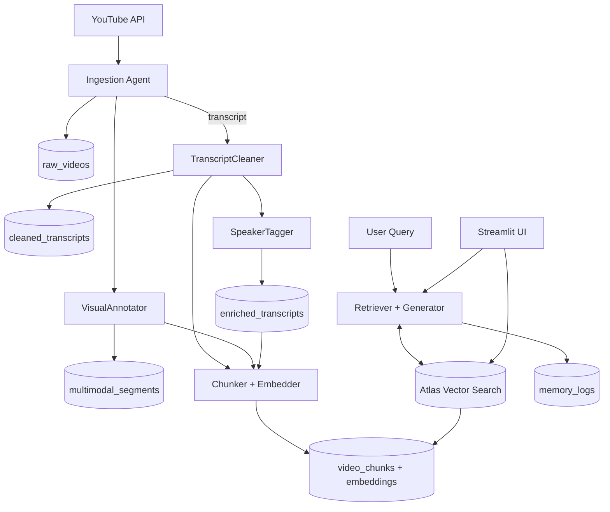

## Mongo Hack — Persistent Context RAG on YouTube

An independent, self-contained prototype that ingests YouTube videos and builds persistent, layered context in MongoDB. Agents clean and enrich transcripts, add visual context, chunk content, and embed it into Atlas Vector Search. A simple UI and retriever generate context-aware answers while logging interactions for long-term memory.

### Architecture Diagram



### Collections Overview

- raw_videos: raw metadata, transcript, thumbnails, derived stats.
- cleaned_transcripts: LLM-cleaned transcript text + paragraphs.
- enriched_transcripts: diarization and speaker role inference.
- multimodal_segments: vision-derived context for key frames.
- video_chunks: semantic chunks with embeddings for retrieval.
- memory_logs: query, retrieved context, and generated answer.

### Getting Started

1. Create MongoDB Atlas project and a database user.
2. Apply `mongodb_schema.json` (collections, indexes, vector index):
   - Atlas UI → Database → Collections → Create collections and indexes.
   - Or use Atlas CLI/API for index creation (see inline index JSON in schema file).
3. Configure environment variables (example):
   - MONGODB_URI
   - MONGODB_DB=mongo_hack
   - VOYAGE_API_KEY (for embeddings)
   - OPENAI_API_KEY (optional, for LLM)
   - YOUTUBE_API_KEY (optional, for metadata)

### Folder Layout (self-contained)

```
Mongo_Hack/
  README.md
  PROJECT.md
  mongodb_schema.json
  agents/
  main.py
  streamlit_app.py
```

### Notes

- This folder is standalone and does not depend on code outside `Mongo_Hack/`.
- The schema targets Atlas Vector Search with cosine similarity and 1024-dim embeddings.
- Replace API keys and dimensions if you use a different embedding model.
- See `ORCHESTRACTION-INTERFACE.md` for the Streamlit-controlled orchestration design.

### Atlas CLI (create vector index)

Replace placeholders and run from shell after installing Atlas CLI and logging in.

```bash
atlas clusters indexes create \
  --projectId <PROJECT_ID> \
  --clusterName <CLUSTER_NAME> \
  --db mongo_hack \
  --collection video_chunks \
  --type vectorSearch \
  --name embedding_index \
  --definition '{
    "mappings": {
      "dynamic": true,
      "fields": {
        "embedding": {
          "type": "knnVector",
          "dimensions": 1024,
          "similarity": "cosine"
        }
      }
    }
  }'
```

### Quickstart

1. Install prerequisites

```
# (Optional) macOS: Atlas CLI for vector index via CLI
brew tap mongodb/brew && brew install mongodb-atlas-cli

# (Optional) create and activate a virtualenv
python3 -m venv .venv
source .venv/bin/activate

# Python dependencies
python3 -m pip install --upgrade pip
pip install -r Mongo_Hack/requirements.txt
```

2. Set environment (create `.env` or export in shell)

```
export MONGODB_URI="<your-atlas-uri>"
export MONGODB_DB="mongo_hack"
export VOYAGE_API_KEY="<voyage-key>"
export OPENAI_API_KEY="<openai-key-optional>"
export YOUTUBE_API_KEY="<youtube-key-optional>"
```

3. Create collections and vector index

- Apply `Mongo_Hack/mongodb_schema.json` in Atlas (Collections + Vector Search index).

4. Seed a small dataset (edit playlist ID in file)

```
python Mongo_Hack/seed_demo.py
```

5. Run the UI

```
streamlit run Mongo_Hack/streamlit_app.py
```

6. RAG CLI smoke-test (optional)

```
python Mongo_Hack/rag.py
```

7. Health check

```
python Mongo_Hack/health_check.py
```

8. Orchestrator (one entrypoint)

```
python Mongo_Hack/main.py ingest --playlist_id <ID> --max 5
python Mongo_Hack/main.py clean --llm
python Mongo_Hack/main.py enrich --llm      # or set ENRICH_WITH_LLM=1
python Mongo_Hack/main.py chunk --llm       # or set CHUNK_WITH_LLM=1
python Mongo_Hack/main.py redundancy --llm  # or set DEDUP_WITH_LLM=1
python Mongo_Hack/main.py trust --llm       # or set TRUST_WITH_LLM=1
python Mongo_Hack/main.py ui
python Mongo_Hack/main.py health
python Mongo_Hack/main.py pipeline --playlist_id <ID> --max 5 --llm
```
