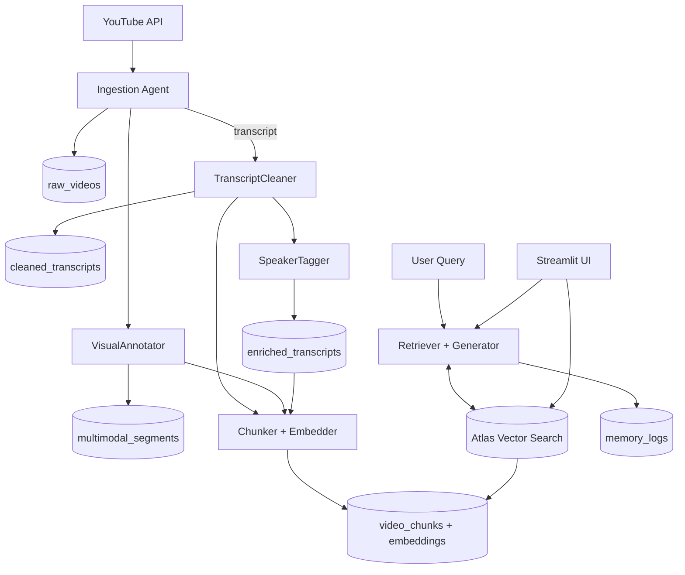

## Mongo Hack — Persistent Context RAG on YouTube

An independent, self-contained prototype that ingests YouTube videos and builds persistent, layered context in MongoDB. Agents clean and enrich transcripts, add visual context, chunk content, and embed it into Atlas Vector Search. A simple UI and retriever generate context-aware answers while logging interactions for long-term memory.

### Architecture Diagram



### Collections Overview

- raw_videos: raw metadata, transcript, thumbnails, derived stats.
- cleaned_transcripts: LLM-cleaned transcript text + paragraphs.
- enriched_transcripts: diarization and speaker role inference.
- multimodal_segments: vision-derived context for key frames.
- video_chunks: semantic chunks with embeddings for retrieval.
- memory_logs: query, retrieved context, and generated answer.

### Getting Started

### Documentation Map (who should read what)

| Audience        | Start Here            | Deep Dive                          | Operations                  |
| --------------- | --------------------- | ---------------------------------- | --------------------------- |
| Reviewer / Demo | DEMO.md               | HYBRID-RETRIEVAL.md                | EXECUTION.md                |
| Developer       | TECHNICAL-CONCEPTS.md | HYBRID-RETRIEVAL.md, REDUNDANCY.md | EXECUTION.md                |
| Prompt/Agents   | PROMPTS.md            | —                                  | ORCHESTRACTION-INTERFACE.md |

### Run the Demo

1. Ensure Atlas index is READY: `python Mongo_Hack/main.py wait_index`
2. Run the UI: `streamlit run Mongo_Hack/streamlit_app.py`
3. Follow `documentation/DEMO.md` for a 7–8 minute walkthrough (Q&A streaming, Hybrid Search with per-operator scores & CSV, feedback loop, personalization, and optional offline mode).

4. Create MongoDB Atlas project and a database user.
5. Apply `mongodb_schema.json` (collections, indexes, vector index):
   - Atlas UI → Database → Collections → Create collections and indexes.
   - Or use Atlas CLI/API for index creation (see inline index JSON in schema file).
6. Configure environment variables (example):
   - MONGODB_URI
   - MONGODB_DB=mongo_hack
   - VOYAGE_API_KEY (for embeddings)
   - OPENAI_API_KEY (optional, for LLM)
   - YOUTUBE_API_KEY (optional, for metadata)

### Folder Layout (self-contained)

```
Mongo_Hack/
  README.md
  mongodb_schema.json
  docs/
    PROJECT.md
    USE-CASE.md
    PROMPTS.md
    EXECUTION.md
    DEMO.md
    ORCHESTRACTION-INTERFACE.md
  agents/
  app/
    stages/
    services/
      filters.py          # shared filter builder for Mongo/Atlas
      ui_utils.py         # shared table/CSV helpers
      persona_utils.py    # infer top tags from feedback
      generation.py       # LLM answer helpers (non-UI)
      retrieval.py        # vector/hybrid/keyword/structured + rerank
    ui/
      tabs/               # split Streamlit tabs (in progress)
  core/
    enrich_utils.py       # enrich text packing/normalization helpers
  pipelines/
  config/
  scripts/
  main.py
  streamlit_app.py
```

### Notes

- This folder is standalone and does not depend on code outside `Mongo_Hack/`.
- The schema targets Atlas Vector Search with cosine similarity and 1024-dim embeddings.
- Replace API keys and dimensions if you use a different embedding model.
- See `ORCHESTRACTION-INTERFACE.md` for the Streamlit-controlled orchestration design.

### What's New (Oct 2025)

- Redundancy improvements: fixed `duplicate_of`, canonical primary selection, adjacency guard with non-adjacent fallback and high-confidence override, `redundancy_method`/`redundancy_reason` fields. See `documentation/REDUNDANCY.md`.
- Trust docs: added trust overview and linkage to redundancy; clarified auto-LLM triggers. See `documentation/REDUNDANCY.md`.
- Chunk hygiene: strip stage cues prior to embedding; persist `display_text` for UI clarity.
- Env updates: new `DEDUP_*` and `TRUST_*` flags in `env.example`.
- Concepts guide: `documentation/TECHNICAL-CONCEPTS.md` explains embeddings, hybrid retrieval, chunking, concurrency, and recommended presets.
- Deep dive: `documentation/HYBRID-RETRIEVAL.md` covers Hybrid Search, hashing fallback, bulk upserts, and `wait_index` for Atlas readiness.

### Atlas Vector Index (CLI or auto-seed)

- Auto-seed (recommended): on first run, the app will attempt to create required collections and the vector index from `config/seed/vector_index.json` if Atlas CLI is installed and envs are set.
- Manual CLI:

```bash
# After atlas auth login
atlas clusters search indexes create \
  --projectId <PROJECT_ID> \
  --clusterName <CLUSTER_NAME> \
  --db mongo_hack \
  --collection video_chunks \
  --file Mongo_Hack/config/seed/vector_index.json

# Check status
atlas clusters search indexes list \
  --projectId <PROJECT_ID> \
  --clusterName <CLUSTER_NAME> \
  --db mongo_hack \
  --collection video_chunks
```

### Quickstart

1. Install prerequisites

```
# (Optional) macOS: Atlas CLI for vector index via CLI
brew tap mongodb/brew && brew install mongodb-atlas-cli

# (Optional) create and activate a virtualenv
python3 -m venv .venv
source .venv/bin/activate

# Python dependencies
python3 -m pip install --upgrade pip
pip install -r Mongo_Hack/requirements.txt
```

2. Set environment (create `.env` or export in shell)

```
export MONGODB_URI="<your-atlas-uri>"
export MONGODB_DB="mongo_hack"
export VOYAGE_API_KEY="<voyage-key>"
export OPENAI_API_KEY="<openai-key-optional>"
export YOUTUBE_API_KEY="<youtube-key-optional>"
export VOYAGE_RPM=5  # recommended for demos to avoid 429s
export PROJECT_ID="<your-atlas-project-id>"
export CLUSTER_NAME="<your-atlas-cluster-name>"
```

3. Collections and vector index

- Auto: run any `python Mongo_Hack/main.py ...` command; on first run, it ensures base collections and attempts to create `embedding_index` using Atlas CLI and envs above.
- Manual UI: create DB `mongo_hack`, collections, and a Vector Search index on `video_chunks.embedding` (dims: 1024, similarity: cosine).
- Manual CLI: see section “Atlas Vector Index (CLI or auto-seed)”.

4. Seed a small dataset (edit playlist ID in file)

```
python Mongo_Hack/seed_demo.py
```

5. Run the UI

```
streamlit run Mongo_Hack/streamlit_app.py
```

6. RAG CLI smoke-test (optional)

```
python Mongo_Hack/rag.py
```

7. Health check

```
python Mongo_Hack/health_check.py
```

8. Orchestrator (one entrypoint)

```
python Mongo_Hack/main.py ingest --playlist_id <ID> --max 5
python Mongo_Hack/main.py clean --llm
python Mongo_Hack/main.py enrich --llm      # or set ENRICH_WITH_LLM=1
python Mongo_Hack/main.py chunk --llm       # or set CHUNK_WITH_LLM=1
export VOYAGE_RPM=5                         # rate limit embeddings
python Mongo_Hack/main.py redundancy --llm  # or set DEDUP_WITH_LLM=1
python Mongo_Hack/main.py trust --llm       # or set TRUST_WITH_LLM=1
python Mongo_Hack/main.py ui
python Mongo_Hack/main.py health
python Mongo_Hack/main.py pipeline --playlist_id <ID> --max 5 --llm
```

### UI Features

- KPIs metrics bar (counts for raw_videos, video_chunks, feedback)
- Explore tab for Mongo searches (raw_videos, video_chunks) with CSV export
- Vector Search tab (semantic-only) with filters and scores
- Q&A with adjustable retrieval weights and Markdown export; preview feedback alpha
- Compare with consensus/unique metrics, trusted chunk tables, Top Channels summary
- Unique insights table with CSV/Markdown export and mini-dashboards (Top Tags, Trust histogram)
- Summaries with optional LLM Markdown and Saved Summaries viewer
- Controller tab to trigger stages/full pipeline with IDs and LLM toggle

### Demo Flow (suggested)

1. Show KPIs on preloaded DB; Explore Mongo queries.
2. Run a Vector Search (semantic-only) and then Q&A.
3. Provide feedback (video + chunks), re-run query.
4. Ingest from Controller; Run Full Pipeline for last args; refresh KPIs.
5. Click New session in Q&A Session expander to demonstrate no prior feedback.
