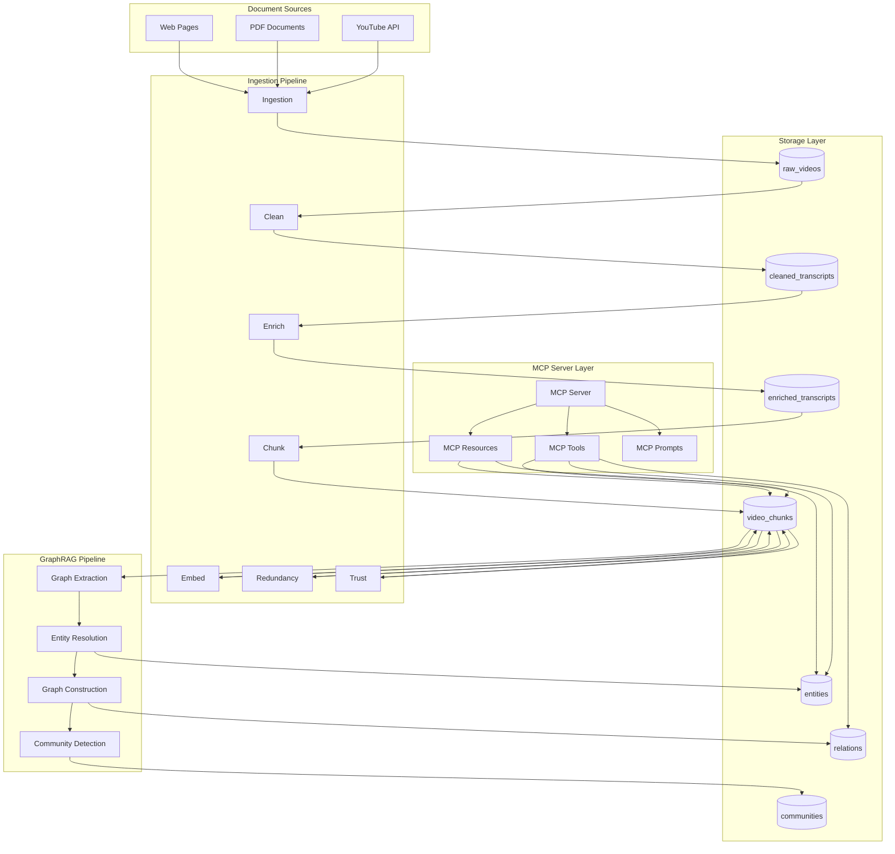

## GraphRAG Knowledge Manager MCP Server

A production-ready Model Context Protocol (MCP) server that manages knowledge graphs from multiple document sources. The system ingests documents (YouTube videos, PDFs, web pages, etc.), processes them through intelligent pipelines, and builds persistent knowledge graphs using GraphRAG technology. Multi-agent pipelines clean, enrich, chunk, and embed content into MongoDB Atlas Vector Search, while GraphRAG constructs entity-relationship graphs for enhanced query understanding.

**Core Capabilities**:

- **Document Ingestion**: Support for YouTube videos, with extensible architecture for PDFs, HTML, and more
- **GraphRAG Knowledge Graphs**: Entity extraction, resolution, and community detection
- **Multi-Agent Pipelines**: Intelligent processing with LLM-powered agents
- **MCP Server**: Exposes tools, resources, and prompts via Model Context Protocol

**New: Multi-Agent CLI Chat** - Memory-aware conversations with PlannerAgent, specialized answer agents, catalog-driven retrieval, and 85% continuity success rate. See `documentation/CHAT.md`.

### Architecture Diagram



### Collections Overview

**Raw Document Collections** (source-specific):

- `raw_videos`: YouTube video metadata, transcripts, thumbnails, stats
- Future: `raw_pdfs`, `raw_html` for other document types

**Processing Collections**:

- `cleaned_transcripts`: LLM-cleaned transcript text + paragraphs
- `enriched_transcripts`: Entities, concepts, tags, code blocks
- `video_chunks`: Per-chunk schema with embeddings, quality scores, and `source_type` field

**GraphRAG Collections**:

- `entities`: Canonicalized entities with descriptions and trust scores
- `relations`: Entity relationships with confidence scores
- `communities`: Entity communities with hierarchical summaries
- `entity_mentions`: Entity mentions linked to source chunks

**Application Collections**:

- `memory_logs`: Query, retrieved context, and generated answers

### Getting Started

### Documentation Map (who should read what)

| Audience        | Start Here    | Deep Dive                           | Operations                  |
| --------------- | ------------- | ----------------------------------- | --------------------------- |
| Reviewer / Demo | DEMO.md       | HYBRID-RETRIEVAL.md                 | EXECUTION.md                |
| Developer       | PIPELINE.md   | TECHNICAL-CONCEPTS.md, GRAPH-RAG.md | EXECUTION.md                |
| Pipeline Dev    | PIPELINE.md   | ORCHESTRACTION-INTERFACE.md         | EXECUTION.md                |
| MCP Integration | MCP-SERVER.md | PIPELINE.md, GRAPH-RAG.md           | ORCHESTRACTION-INTERFACE.md |
| Prompt/Agents   | PROMPTS.md    | —                                   | ORCHESTRACTION-INTERFACE.md |

### Run the Demo

1. Ensure Atlas index is READY: `python Mongo_Hack/main.py wait_index`
2. Run the UI: `streamlit run Mongo_Hack/streamlit_app.py`
3. Follow `documentation/DEMO.md` for a 7–8 minute walkthrough (Q&A streaming, Hybrid Search with per-operator scores & CSV, feedback loop, personalization, and optional offline mode).

4. Create MongoDB Atlas project and a database user.
5. Apply `mongodb_schema.json` (collections, indexes, vector index):
   - Atlas UI → Database → Collections → Create collections and indexes.
   - Or use Atlas CLI/API for index creation (see inline index JSON in schema file).
6. Configure environment variables (example):
   - MONGODB_URI
   - MONGODB_DB=mongo_hack
   - VOYAGE_API_KEY (for embeddings)
   - OPENAI_API_KEY (optional, for LLM)
   - YOUTUBE_API_KEY (optional, for metadata)

### Folder Layout

```
YoutubeRAG/
  README.md
  mongodb_schema.json
  chat.py                     # NEW: Multi-agent CLI chat orchestrator
  documentation/
    CHAT.md                   # NEW: CLI chat architecture & usage
    PROJECT.md
    USE-CASE.md
    PROMPTS.md
    EXECUTION.md
    DEMO.md
    ORCHESTRACTION-INTERFACE.md
    TECHNICAL-CONCEPTS.md
    HYBRID-RETRIEVAL.md
    REDUNDANCY.md
    BACKLOG.md
  agents/
    planner_agent.py          # NEW: Adaptive retrieval planning
    reference_answer_agent.py # NEW: Concise Q&A answers
    topic_reference_agent.py  # NEW: Multi-topic guides
    enrich_agent.py
    clean_agent.py
    trust_agent.py
    dedup_agent.py
    summarizer_agent.py
  app/
    stages/
    services/
      indexes.py              # NEW: Centralized Vector/Search index config
      metadata.py             # NEW: Catalog building & pruning
      retrieval.py            # Enhanced with MMR, filter expansion
      generation.py
      filters.py
      ui_utils.py
      log_utils.py            # NEW: Timer utility
    queries/
    pipelines/
  core/
    enrich_utils.py
    base_agent.py
    base_pipeline.py
  pipelines/
    video_pipeline.py
  config/
    seed/
      seed_indexes.py         # Uses app/services/indexes.py
  chat_logs/                  # NEW: Per-session log files
  main.py
  streamlit_app.py
```

### Notes

- This folder is standalone and does not depend on code outside `Mongo_Hack/`.
- The schema targets Atlas Vector Search with cosine similarity and 1024-dim embeddings.
- Replace API keys and dimensions if you use a different embedding model.
- See `ORCHESTRACTION-INTERFACE.md` for the Streamlit-controlled orchestration design.

### What's New (Oct 2025)

- Redundancy improvements: fixed `duplicate_of`, canonical primary selection, adjacency guard with non-adjacent fallback and high-confidence override, `redundancy_method`/`redundancy_reason` fields. See `documentation/REDUNDANCY.md`.
- Trust docs: added trust overview and linkage to redundancy; clarified auto-LLM triggers. See `documentation/REDUNDANCY.md`.
- Chunk hygiene: strip stage cues prior to embedding; persist `display_text` for UI clarity.
- Env updates: new `DEDUP_*` and `TRUST_*` flags in `env.example`.
- Concepts guide: `documentation/TECHNICAL-CONCEPTS.md` explains embeddings, hybrid retrieval, chunking, concurrency, and recommended presets.
- Deep dive: `documentation/HYBRID-RETRIEVAL.md` covers Hybrid Search, hashing fallback, bulk upserts, and `wait_index` for Atlas readiness.

### Pipeline runner (typed configs)

The new pipeline supports sequential execution of stages with explicit, typed configuration objects. Each stage has a Config dataclass with defaults. The runner orchestrates them and supports per-stage IO overrides (separate read/write DBs and collections) and a simple policy to stop or continue on errors.

Example (clean → chunk → enrich) with cross‑DB IO:

```python
from app.pipelines.base_pipeline import StageSpec, PipelineRunner
from app.stages.clean import CleanConfig
from app.stages.chunk import ChunkConfig
from app.stages.enrich import EnrichConfig

specs = [
    StageSpec(stage="clean", config=CleanConfig(
        concurrency=8,
        read_db_name="source_db", read_coll="raw_videos",
        write_db_name="work_db", write_coll="cleaned_transcripts",
    )),
    StageSpec(stage="chunk", config=ChunkConfig(
        chunk_strategy="recursive", token_size=800, overlap_pct=0.15,
        read_db_name="work_db", read_coll="cleaned_transcripts",
        write_db_name="work_db", write_coll="video_chunks",
    )),
    StageSpec(stage="enrich", config=EnrichConfig(
        concurrency=8,
        read_db_name="work_db", read_coll="video_chunks",
        write_db_name="work_db", write_coll="video_chunks",
    )),
]

PipelineRunner(specs, stop_on_error=True).run()
```

**GraphRAG Pipeline Example** (entity extraction → resolution → graph construction → community detection):

```python
from app.pipelines.graphrag_pipeline import GraphRAGPipeline
from config.graphrag_config import GraphRAGPipelineConfig

# Create pipeline configuration
config = GraphRAGPipelineConfig()
config.extraction_config.max = 100  # Process 100 chunks
config.extraction_config.model_name = "gpt-4o-mini"

# Create and run pipeline
pipeline = GraphRAGPipeline(config)
exit_code = pipeline.run_full_pipeline()

# Or run individual stages
exit_code = pipeline.run_stage("graph_extraction")
```

CLI examples:

- Traditional pipeline: `python Mongo_Hack/app/pipelines/examples/yt_clean_enrich.py`
- GraphRAG pipeline: `python run_graphrag_pipeline.py --stage graph_extraction`

Notes:

- Stages still run standalone with CLI/args for backward compatibility.
- Config dataclasses are the source of truth (env/args optional).

### Atlas Vector Index (CLI or auto-seed)

- Auto-seed (recommended): on first run, the app will attempt to create required collections and the vector index from `config/seed/vector_index.json` if Atlas CLI is installed and envs are set.
- Manual CLI:

```bash
# After atlas auth login
atlas clusters search indexes create \
  --projectId <PROJECT_ID> \
  --clusterName <CLUSTER_NAME> \
  --db mongo_hack \
  --collection video_chunks \
  --file Mongo_Hack/config/seed/vector_index.json

# Check status
atlas clusters search indexes list \
  --projectId <PROJECT_ID> \
  --clusterName <CLUSTER_NAME> \
  --db mongo_hack \
  --collection video_chunks
```

### Quickstart

1. Install prerequisites

```
# (Optional) macOS: Atlas CLI for vector index via CLI
brew tap mongodb/brew && brew install mongodb-atlas-cli

# (Optional) create and activate a virtualenv
python3 -m venv .venv
source .venv/bin/activate

# Python dependencies
python3 -m pip install --upgrade pip
pip install -r Mongo_Hack/requirements.txt
```

2. Set environment (create `.env` or export in shell)

```
export MONGODB_URI="<your-atlas-uri>"
export MONGODB_DB="mongo_hack"
export VOYAGE_API_KEY="<voyage-key>"
export OPENAI_API_KEY="<openai-key-optional>"
export YOUTUBE_API_KEY="<youtube-key-optional>"
export VOYAGE_RPM=5  # recommended for demos to avoid 429s
export PROJECT_ID="<your-atlas-project-id>"
export CLUSTER_NAME="<your-atlas-cluster-name>"
```

3. Collections and vector index

- Auto: run any `python Mongo_Hack/main.py ...` command; on first run, it ensures base collections and attempts to create `embedding_index` using Atlas CLI and envs above.
- Manual UI: create DB `mongo_hack`, collections, and a Vector Search index on `video_chunks.embedding` (dims: 1024, similarity: cosine).
- Manual CLI: see section “Atlas Vector Index (CLI or auto-seed)”.

4. Seed a small dataset (edit playlist ID in file)

```
python Mongo_Hack/seed_demo.py
```

5. Run the UI

```
streamlit run Mongo_Hack/streamlit_app.py
```

6. RAG CLI smoke-test (optional)

```
python Mongo_Hack/rag.py
```

7. Health check

```
python Mongo_Hack/health_check.py
```

8. Orchestrator (one entrypoint)

```
python Mongo_Hack/main.py ingest --playlist_id <ID> --max 5 --db_name mongo_hack
python Mongo_Hack/main.py clean --llm --db_name mongo_hack
python Mongo_Hack/main.py enrich --llm --db_name mongo_hack      # or set ENRICH_WITH_LLM=1
python Mongo_Hack/app/stages/chunk.py --db_name mongo_hack
python Mongo_Hack/app/stages/enrich.py --db_name mongo_hack
python Mongo_Hack/app/stages/embed.py --db_name mongo_hack --embed_source chunk
export VOYAGE_RPM=5                         # rate limit embeddings
python Mongo_Hack/main.py redundancy --llm --db_name mongo_hack  # or set REDUNDANCY_WITH_LLM=1
python Mongo_Hack/main.py trust --llm --db_name mongo_hack       # or set TRUST_WITH_LLM=1
python Mongo_Hack/main.py ui
python Mongo_Hack/main.py health
python Mongo_Hack/main.py pipeline --playlist_id <ID> --max 5 --llm
```

### Pipeline runner (typed configs)

See `app/pipelines/examples/yt_clean_enrich.py` for a full example (clean → compress → chunk → enrich → embed) with explicit read/write DBs and typed config objects per stage.

Notes:

- Stages still run standalone with CLI/args for backward compatibility.
- Config dataclasses are the source of truth (env/args optional).

New options overview:

- Clean: filler removal, paragraphization; LLM flags `--llm_retries`, `--llm_backoff_s`, `--llm_qps`, `--model_name`.
- Chunk: `metadata.chunk_index` and `metadata.chunk_count` for ordering.
- Enrich: conceptual relations prompt, confidence levels, `quality_score`, always sets `embedding_text`.
- Embed: hybrid `embedding_text` by default, `vector_norm`, optional multi-vector outputs; flags `--use_hybrid_embedding_text/--no_use_hybrid_embedding_text`, `--unit_normalize_embeddings/--no_unit_normalize_embeddings`, `--emit_multi_vectors`.

### CLI Chat (NEW)

**Multi-agent, memory-aware chat system** with adaptive retrieval:

```bash
python chat.py --top_k 200 --mode auto
```

Features:

- **Conversation continuity**: Detects follow-ups, auto-expands queries with memory context
- **Smart planning**: PlannerAgent chooses route/mode/k/filters based on query + catalog + history
- **Specialized agents**: TopicReferenceAgent (guides) vs ReferenceAnswerAgent (focused Q&A)
- **Quality-first**: Query-aware catalog pruning (36K→80 values), filter expansion, MMR diversification
- **Dev logging**: Per-session logs with agent prompts, decisions, chunk dumps

In-chat commands: `:exit`, `:new`, `:history`, `:id`, `:export json|txt|md`

See `documentation/CHAT.md` for full details.

---

### Index Management

MongoDB Atlas Vector Search indexes are auto-created by the chat system:

- Vector Search index (type: `vectorSearch`): For $vectorSearch with filters
- Hybrid Search index (type: `search`): For knnBeta + text search

Configuration centralized in `app/services/indexes.py`.

### Chunking strategies

The chunk stage supports three strategies selectable via `--chunk_strategy` (default: `fixed`).

- Fixed token size with overlap:

  - Uses TokenTextSplitter (tiktoken).
  - Example: `python Mongo_Hack/app/stages/chunk_embed.py --chunk_strategy fixed --token_size 500 --overlap_pct 0.15 --db_name mongo_hack`

- Recursive with overlap:

  - Uses RecursiveCharacterTextSplitter and packs to tokens.
  - Example: `python Mongo_Hack/app/stages/chunk_embed.py --chunk_strategy recursive --token_size 400 --overlap_pct 0.1 --split_chars ".,;"`

- Semantic:
  - Uses SemanticChunker to merge semantically similar sentence groups.
  - Requires embeddings provider (defaults to OpenAI embeddings); set `OPENAI_API_KEY` and optionally `--semantic_model`.
  - Example: `python Mongo_Hack/app/stages/chunk_embed.py --chunk_strategy semantic --token_size 500 --overlap_pct 0.15 --split_chars "." --semantic_model text-embedding-3-small`

Note: All chunk configuration used is stored per chunk under `metadata.chunking` for auditability.

### UI Features

- KPIs metrics bar (counts for raw_videos, video_chunks, feedback)
- Explore tab for Mongo searches (raw_videos, video_chunks) with CSV export
- Vector Search tab (semantic-only) with filters and scores
- Q&A with adjustable retrieval weights and Markdown export; preview feedback alpha
- Compare with consensus/unique metrics, trusted chunk tables, Top Channels summary
- Unique insights table with CSV/Markdown export and mini-dashboards (Top Tags, Trust histogram)
- Summaries with optional LLM Markdown and Saved Summaries viewer
- Controller tab to trigger stages/full pipeline with IDs and LLM toggle

### Demo Flow (suggested)

1. Show KPIs on preloaded DB; Explore Mongo queries.
2. Run a Vector Search (semantic-only) and then Q&A.
3. Provide feedback (video + chunks), re-run query.
4. Ingest from Controller; Run Full Pipeline for last args; refresh KPIs.
5. Click New session in Q&A Session expander to demonstrate no prior feedback.
