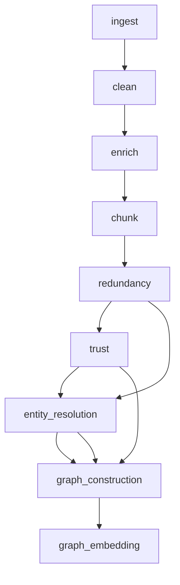

# GraphRAG Implementation Guide

**Note**: This GraphRAG system is part of the GraphRAG Knowledge Manager MCP Server. For MCP server integration, see `documentation/MCP-SERVER.md`.

## Overview

This document outlines the implementation of GraphRAG (Graph-based Retrieval-Augmented Generation) for the YouTubeRAG project. GraphRAG extends our current vector-based RAG system by constructing and leveraging a knowledge graph to improve retrieval quality, enable multi-hop reasoning, and provide more contextual answers.

This implementation builds upon Microsoft's GraphRAG research while addressing its limitations and leveraging our existing YouTubeRAG infrastructure, including the `redundancy` and `trust` stages for enhanced entity resolution and quality scoring.

## Table of Contents

1. [GraphRAG Architecture](#graphrag-architecture)
2. [Microsoft GraphRAG Analysis](#microsoft-graphrag-analysis)
3. [Enhanced Implementation Strategy](#enhanced-implementation-strategy)
4. [Data Model & Schema](#data-model--schema)
5. [Pipeline Integration](#pipeline-integration)
6. [Entity Resolution & Graph Construction](#entity-resolution--graph-construction)
7. [Graph-Aware Retrieval](#graph-aware-retrieval)
8. [Query Processing](#query-processing)
9. [Implementation Phases](#implementation-phases)
10. [Configuration & Environment](#configuration--environment)
11. [Performance Considerations](#performance-considerations)
12. [Migration Strategy](#migration-strategy)
13. [Limitations & Challenges](#limitations--challenges)

## GraphRAG Architecture

### Current vs GraphRAG Architecture

**Current RAG Flow:**

```
Query → Embedding → Vector Search → Rerank → Generate Answer
```

**GraphRAG Flow:**

```
Query → Entity Extraction → Graph Expansion → Multi-Modal Retrieval → Graph-Aware Ranking → Generate Answer
```

### Core Components

1. **Knowledge Graph Construction**

   - Entity extraction and canonicalization
   - Relationship mapping across chunks
   - Graph metrics computation (centrality, clustering)

2. **Graph-Aware Retrieval**

   - Entity-based query expansion
   - Multi-hop relationship traversal
   - Graph-informed ranking

3. **Enhanced Query Processing**
   - Intent analysis and entity extraction
   - Graph context assembly
   - Multi-modal answer generation

## Microsoft GraphRAG Analysis

### Core Concepts from Microsoft's Research

Microsoft's GraphRAG introduces two fundamental concepts that address traditional RAG limitations:

#### 1. Summaries at Different Scales as Context

- **Problem**: Traditional RAG assumes all necessary information is in small local chunks
- **Solution**: Create hierarchical summaries from individual chunks → communities → higher-level communities
- **Benefit**: Provides both local and global context to LLMs

#### 2. Graphical Representation of Information

- **Problem**: Text-based similarity may miss logical connections across chunks
- **Solution**: Represent information as nodes (entities) and edges (relationships)
- **Benefit**: Enables multi-hop reasoning and relationship traversal

### Microsoft's Indexing Pipeline

1. **Documents → Text Chunks**: Break documents into 1200-token chunks
2. **Text Chunks → Element Instances**: Extract entities and relationships using LLM
3. **Element Instances → Element Summaries**: Merge descriptions for same entities
4. **Knowledge Graph**: Aggregate all triplets into unified graph
5. **Community Detection**: Use Leiden algorithm to find densely connected clusters
6. **Community Summaries**: Generate summaries for each community at different scales

### Key Strengths of Microsoft's Approach

✅ **Hierarchical Community Structure**: Multi-level communities provide context at different scales  
✅ **Entity Resolution Strategy**: Merging descriptions creates holistic entity views  
✅ **Community Summarization**: Reduces noise by summarizing communities instead of individual nodes  
✅ **Leiden Algorithm**: Better than Louvain for ensuring well-connected communities  
✅ **Scalable Summarization**: Hierarchical structure enables efficient summary generation

### Critical Limitations Identified

❌ **Scalability Issues**: Acknowledges but doesn't solve large-scale problems  
❌ **Entity Disambiguation**: Limited handling of lexical variations and entity resolution  
❌ **Relationship Quality**: No validation of extracted relationships  
❌ **Dynamic Updates**: No strategy for incremental graph updates  
❌ **Query Processing**: Limited discussion of query-graph interaction  
❌ **Quality Assurance**: No systematic validation of graph construction  
❌ **Performance**: No optimization strategies for production deployment

## Enhanced Implementation Strategy

### Our Approach: Building on Microsoft's Foundation

Our implementation addresses Microsoft's limitations while leveraging our existing YouTubeRAG infrastructure:

#### 1. Multi-Strategy Entity Resolution

**Microsoft's Limitation**: Simple concatenation and summarization  
**Our Enhancement**:

- Fuzzy string matching
- Embedding-based similarity
- Context-based resolution
- Relationship clustering
- Trust-weighted resolution (using existing trust scores)

#### 2. Enhanced Community Detection

**Microsoft's Limitation**: Only uses Leiden algorithm  
**Our Enhancement**:

- Structural communities (Leiden)
- Semantic communities (embedding-based)
- Trust-weighted communities
- Entity-type aware communities
- Temporal communities (YouTube-specific)

#### 3. Incremental Graph Updates

**Microsoft's Gap**: No incremental update strategy  
**Our Solution**:

- Delta graph updates
- Community reassignment
- Summary refresh
- Trust propagation

#### 4. YouTube-Specific Enhancements

**Microsoft's Gap**: Generic approach  
**Our Enhancement**:

- Temporal community detection
- Channel-based entity resolution
- Engagement-weighted trust scores
- Content evolution tracking

### Integration with Existing Stages

Our implementation leverages existing `redundancy` and `trust` stages:

- **Redundancy Stage**: Provides entity canonicalization signals
- **Trust Stage**: Provides entity importance and quality signals
- **Enhanced Pipeline**: Seamless integration with existing workflow

## Data Model & Schema

### New Collections

#### 1. Entities Collection (Enhanced)

```json
{
  "_id": "entity_uuid",
  "name": "Python",
  "canonical_name": "Python Programming Language",
  "type": "Technology",
  "aliases": ["Python", "Python3", "Python programming"],
  "description": "High-level programming language",
  "properties": {
    "category": "Programming Language",
    "created_year": 1991,
    "paradigm": ["object-oriented", "functional"]
  },
  "embedding": [0.1, 0.2, ...],
  "centrality_score": 0.85,
  "mention_count": 156,
  "trust_score": 0.78,
  "resolution_confidence": 0.92,
  "resolution_methods": ["fuzzy", "embedding", "context", "relationship"],
  "first_seen": "2024-01-15T10:30:00Z",
  "last_seen": "2024-01-20T15:45:00Z",
  "source_chunks": ["chunk_id_1", "chunk_id_2"],
  "community_assignments": {
    "level_1": ["community_1", "community_3"],
    "level_2": ["community_5"]
  },
  "youtube_metrics": {
    "channel_distribution": {"tech_channels": 45, "education_channels": 32},
    "engagement_score": 0.87,
    "temporal_trends": {"2024-01": 0.8, "2024-02": 0.9}
  }
}
```

#### 2. Relations Collection (Enhanced)

```json
{
  "_id": "relation_uuid",
  "subject_id": "entity_uuid_1",
  "predicate": "implements",
  "object_id": "entity_uuid_2",
  "confidence": 0.92,
  "context_chunks": ["chunk_id_1", "chunk_id_2"],
  "source_videos": ["video_id_1", "video_id_2"],
  "properties": {
    "temporal": "2024-01-15",
    "confidence_sources": ["llm_extraction", "pattern_matching"],
    "validation_status": "validated",
    "trust_score": 0.88
  },
  "strength": 0.85,
  "extraction_method": "llm_structured",
  "validation_evidence": ["cross_chunk_consistency", "pattern_match"],
  "youtube_context": {
    "channel_types": ["tech", "education"],
    "video_categories": ["tutorial", "review"],
    "engagement_weight": 0.92
  }
}
```

#### 3. Entity Mentions Collection

```json
{
  "_id": "mention_uuid",
  "entity_id": "entity_uuid",
  "chunk_id": "chunk_id",
  "video_id": "video_id",
  "mention_text": "Python programming",
  "context": "Python is a versatile programming language",
  "position": 45,
  "confidence": 0.95,
  "relevance_score": 0.88
}
```

#### 4. Communities Collection (NEW)

```json
{
  "_id": "community_uuid",
  "name": "Python Development Community",
  "level": 1,
  "parent_community": "community_5",
  "child_communities": ["community_1", "community_3"],
  "entities": ["entity_1", "entity_2", "entity_3"],
  "summary": "Community focused on Python development practices...",
  "coherence_score": 0.87,
  "connectivity_score": 0.92,
  "trust_aggregate": 0.81,
  "temporal_stability": 0.89,
  "detection_methods": ["leiden", "semantic", "trust_weighted"],
  "created_at": "2024-01-15T10:30:00Z",
  "last_updated": "2024-01-20T15:45:00Z",
  "youtube_metrics": {
    "channel_diversity": 0.85,
    "content_freshness": 0.78,
    "engagement_trend": "increasing"
  }
}
```

#### 5. Graph Embeddings Collection (Enhanced)

```json
{
  "_id": "graph_embedding_uuid",
  "entity_id": "entity_uuid",
  "graph_embedding": [0.1, 0.2, ...],
  "embedding_type": "entity_contextual",
  "computed_at": "2024-01-20T10:30:00Z",
  "model_version": "voyage-2-graph",
  "community_context": ["community_1", "community_3"],
  "trust_weight": 0.88,
  "temporal_context": "2024-01"
}
```

### Enhanced Chunk Schema

Extend existing `video_chunks` collection:

```json
{
  // ... existing fields ...
  "entity_mentions": [
    {
      "entity_id": "entity_uuid",
      "mention_text": "Python",
      "confidence": 0.95,
      "relevance": 0.88
    }
  ],
  "concept_mentions": [
    {
      "concept_id": "concept_uuid",
      "mention_text": "machine learning",
      "confidence": 0.92
    }
  ],
  "graph_metrics": {
    "entity_density": 0.15,
    "concept_coverage": 0.23,
    "relationship_count": 3
  }
}
```

## Pipeline Integration

### Ingestion Pipeline Integration

GraphRAG pipeline integrates with the ingestion pipeline:

1. **Input**: Processed chunks from `video_chunks` collection (with embeddings, redundancy scores, trust scores)
2. **Quality Signals**: Uses redundancy and trust scores for entity resolution and weighting
3. **Source Type Awareness**: Respects `source_type` field for document-type-specific processing

### GraphRAG Pipeline Stages

The GraphRAG pipeline consists of four stages:

1. **Graph Extraction**: Extract entities and relationships from chunks
2. **Entity Resolution**: Canonicalize entities using multi-strategy resolution
3. **Graph Construction**: Build knowledge graph from resolved entities
4. **Community Detection**: Detect communities and generate summaries

**See**: `documentation/PIPELINE.md` for comprehensive pipeline documentation.

## MCP Server Integration

### MCP Tools for GraphRAG

The GraphRAG system exposes the following MCP tools for AI assistant integration:

- **`query_knowledge_graph`**: Query entities, relationships, and communities
- **`get_entity_details`**: Retrieve detailed entity information
- **`get_community_summary`**: Get community summaries and details
- **`create_entity`**: Manually create or update entities
- **`create_relationship`**: Manually create relationships
- **`merge_entities`**: Merge entities for canonicalization
- **`detect_communities`**: Trigger community detection

### MCP Resources for GraphRAG

- **`graphrag://schema/entities`**: Entity schema definitions
- **`graphrag://schema/relations`**: Relationship schema definitions
- **`graphrag://communities/{id}/summary`**: Community summaries
- **`graphrag://templates/entity`**: Entity creation templates

### Example MCP-Driven Query

```
User (via Claude): "What entities are related to machine learning?"

Claude (using MCP):
  1. Calls query_knowledge_graph(query="machine learning", query_type="entity_search")
  2. Receives entities and their relationships
  3. Calls get_entity_details for each entity
  4. Assembles comprehensive answer using graph structure
```

**See**: `documentation/MCP-SERVER.md` for detailed MCP server implementation.

## Pipeline Integration (Detailed)

### Updated Pipeline Stages

```python
class GraphRAGPipeline(BasePipeline):
    def __init__(self) -> None:
        self.stages: list[str] = [
            "ingest",           # YouTube data ingestion
            "clean",            # Transcript cleaning
            "enrich",           # Entity/concept extraction
            "chunk",            # Text chunking
            "redundancy",       # Duplicate detection (KEEP)
            "trust",            # Trust scoring (KEEP)
            "entity_resolution", # NEW: Entity canonicalization
            "graph_construction", # NEW: Knowledge graph building
            "graph_embedding",   # NEW: Graph-aware embeddings
        ]
```

### Stage Dependencies



## Entity Resolution & Graph Construction

### Entity Resolution Agent

```python
class EntityResolutionAgent(BaseAgent):
    """Resolves entities across chunks and builds canonical entity registry."""

    def resolve_entities(self, chunk_entities: List[Dict]) -> Dict[str, Any]:
        """Resolve entities using fuzzy matching and embeddings."""

    def build_entity_graph(self, entities: List[Dict]) -> Dict[str, Any]:
        """Construct entity-relationship graph."""

    def compute_centrality_scores(self, graph: Dict) -> Dict[str, float]:
        """Compute graph centrality scores for entities."""
```

### Graph Construction Stage

```python
class GraphConstructionStage(BaseStage):
    """Builds knowledge graph from enriched chunks."""

    def build_entity_registry(self) -> None:
        """Create canonical entity registry from all chunks."""

    def build_relation_graph(self) -> None:
        """Construct entity-relationship graph."""

    def compute_graph_metrics(self) -> None:
        """Calculate centrality, clustering, and other graph metrics."""
```

### Enhanced Entity Resolution Process

Our implementation addresses Microsoft's limitations with a multi-strategy approach:

#### 1. Multi-Strategy Entity Resolution

```python
class EnhancedEntityResolution:
    """Advanced entity resolution with multiple strategies."""

    def resolve_entities(self, entity_mentions: List[Dict]) -> Dict[str, Any]:
        """Multi-strategy entity resolution."""

        # 1. Fuzzy string matching
        fuzzy_matches = self.fuzzy_string_matching(entity_mentions)

        # 2. Embedding-based similarity
        embedding_matches = self.embedding_similarity(entity_mentions)

        # 3. Context-based resolution
        context_matches = self.context_similarity(entity_mentions)

        # 4. Relationship-based clustering
        relationship_clusters = self.relationship_clustering(entity_mentions)

        # 5. Trust-weighted resolution (using existing trust scores)
        trust_weighted = self.trust_weighted_resolution(entity_mentions)

        return self.combine_resolution_strategies([
            fuzzy_matches, embedding_matches, context_matches,
            relationship_clusters, trust_weighted
        ])
```

#### 2. Entity Resolution Steps

1. **Entity Extraction**: Extract entities from enriched chunks
2. **Multi-Strategy Matching**:
   - String similarity (Levenshtein distance)
   - Embedding similarity (cosine distance)
   - Context similarity
   - Relationship clustering
   - Trust-weighted resolution
3. **Confidence Scoring**: Assign confidence scores to each resolution
4. **Canonicalization**: Create canonical entity representations
5. **Cross-Validation**: Validate resolutions across multiple strategies
6. **Relationship Mapping**: Identify relationships between entities
7. **Graph Construction**: Build knowledge graph with entities as nodes and relationships as edges

### Enhanced Community Detection

Our implementation goes beyond Microsoft's single-algorithm approach:

#### 1. Multi-Modal Community Detection

```python
class MultiModalCommunityDetection:
    """Enhanced community detection with multiple signals."""

    def detect_communities(self, graph: Dict) -> Dict[str, Any]:
        """Multi-modal community detection."""

        # 1. Structural communities (Leiden)
        structural_communities = self.leiden_communities(graph)

        # 2. Semantic communities (embedding-based)
        semantic_communities = self.embedding_clustering(graph)

        # 3. Trust-weighted communities
        trust_communities = self.trust_weighted_clustering(graph)

        # 4. Entity-type aware communities
        typed_communities = self.entity_type_clustering(graph)

        # 5. Temporal communities (YouTube-specific)
        temporal_communities = self.temporal_clustering(graph)

        return self.merge_community_types([
            structural_communities, semantic_communities,
            trust_communities, typed_communities, temporal_communities
        ])
```

#### 2. Community Quality Metrics

- **Coherence Score**: How well entities within community relate
- **Connectivity Score**: Internal connectivity vs external connections
- **Trust Aggregate**: Average trust score of community entities
- **Temporal Stability**: How stable community is over time
- **Channel Diversity**: Distribution across YouTube channels

## Graph-Aware Retrieval

### Enhanced Retrieval Functions

```python
def graph_rag_search(
    col: Collection,
    query_text: str,
    query_vector: List[float],
    top_k: int = 8,
    graph_expansion: bool = True,
    filters: Optional[Dict[str, Any]] = None,
) -> List[Dict[str, Any]]:
    """GraphRAG search with entity expansion and graph traversal."""

    # 1. Extract entities from query
    query_entities = extract_query_entities(query_text)

    # 2. Find related entities in graph
    expanded_entities = expand_entity_graph(query_entities) if graph_expansion else query_entities

    # 3. Vector search with entity filters
    vector_hits = vector_search_with_entities(col, query_vector, expanded_entities, top_k)

    # 4. Graph-based ranking
    ranked_hits = rank_by_graph_centrality(vector_hits, expanded_entities)

    return ranked_hits
```

### Graph Traversal Service

```python
class GraphTraversalService:
    """Handles graph traversal and entity expansion."""

    def find_related_entities(self, entity_ids: List[str], max_depth: int = 2) -> List[str]:
        """Find entities related through graph traversal."""

    def compute_subgraph_centrality(self, entity_ids: List[str]) -> Dict[str, float]:
        """Compute centrality scores for entity subgraph."""

    def find_bridging_entities(self, entity_set_1: List[str], entity_set_2: List[str]) -> List[str]:
        """Find entities that bridge two entity sets."""
```

### Multi-Modal Retrieval

1. **Vector Search**: Traditional semantic similarity
2. **Entity Search**: Direct entity matching
3. **Relationship Search**: Traverse entity relationships
4. **Hybrid Search**: Combine all modalities

### Graph-Based Ranking

```python
def rank_by_graph_centrality(hits: List[Dict], entities: List[str]) -> List[Dict]:
    """Rank results using graph centrality and entity relationships."""

    for hit in hits:
        # Compute graph-based score
        entity_score = compute_entity_relevance(hit, entities)
        centrality_score = compute_centrality_score(hit)
        relationship_score = compute_relationship_score(hit, entities)

        # Combine scores
        hit["graph_score"] = (
            0.4 * entity_score +
            0.3 * centrality_score +
            0.3 * relationship_score
        )

    return sorted(hits, key=lambda x: x["graph_score"], reverse=True)
```

## Query Processing

### GraphRAG Query Processor

```python
class GraphRAGQueryProcessor:
    """Processes queries using graph-aware techniques."""

    def process_query(self, query: str) -> Dict[str, Any]:
        """Main GraphRAG query processing pipeline."""

        # 1. Query Analysis
        query_analysis = self.analyze_query_intent(query)

        # 2. Entity Extraction & Expansion
        entities = self.extract_and_expand_entities(query)

        # 3. Graph-Aware Retrieval
        chunks = self.graph_aware_retrieval(query, entities)

        # 4. Graph-Based Ranking
        ranked_chunks = self.rank_by_graph_metrics(chunks, entities)

        # 5. Context Assembly
        context = self.assemble_graph_context(ranked_chunks, entities)

        return {
            "chunks": ranked_chunks,
            "entities": entities,
            "context": context,
            "graph_metrics": self.compute_query_graph_metrics(entities)
        }
```

### Query Types Supported

1. **Entity-Centric Queries**: "What is Python used for?"
2. **Relationship Queries**: "How does Python relate to machine learning?"
3. **Conceptual Queries**: "What are the best practices for Python development?"
4. **Multi-Hop Queries**: "What frameworks use Python for web development?"

### Context Assembly

```python
def assemble_graph_context(chunks: List[Dict], entities: List[str]) -> str:
    """Assemble context using graph relationships."""

    context_parts = []

    # Add primary chunks
    for chunk in chunks[:5]:
        context_parts.append(f"**{chunk['video_title']}**\n{chunk['text']}")

    # Add related entity context
    related_entities = find_related_entities(entities)
    for entity in related_entities:
        entity_context = get_entity_context(entity)
        context_parts.append(f"**About {entity['name']}**: {entity_context}")

    return "\n\n".join(context_parts)
```

## Implementation Phases

### Phase 1: Foundation (Weeks 1-2)

**Goals**: Set up GraphRAG infrastructure and data models

**Tasks**:

1. **Database Schema Updates**

   - Create new GraphRAG collections
   - Update existing chunk schema
   - Create indexes for graph queries

2. **Entity Resolution Agent**

   - Implement fuzzy entity matching
   - Build canonical entity registry
   - Cross-chunk entity linking

3. **Basic Graph Construction**
   - Entity-relationship extraction
   - Simple graph storage
   - Basic graph metrics

**Deliverables**:

- New collections created
- Entity resolution working
- Basic knowledge graph constructed

### Phase 2: Graph Construction (Weeks 3-4)

**Goals**: Build comprehensive knowledge graph

**Tasks**:

1. **Graph Construction Stage**

   - Full entity-relationship extraction
   - Graph metrics computation
   - Centrality score calculation

2. **Graph Storage & Indexing**

   - MongoDB graph storage optimization
   - Graph query indexes
   - Relationship traversal optimization

3. **Integration with Existing Stages**
   - Use redundancy data for entity canonicalization
   - Use trust scores for entity importance
   - Quality filtering integration

**Deliverables**:

- Complete knowledge graph
- Graph metrics computed
- Integration with existing pipeline

### Phase 3: Graph Retrieval (Weeks 5-6)

**Goals**: Implement graph-aware retrieval

**Tasks**:

1. **Graph-Aware Retrieval**

   - Entity expansion algorithms
   - Graph traversal implementation
   - Graph-based ranking

2. **Enhanced Query Processing**

   - Query entity extraction
   - Graph context assembly
   - Multi-modal retrieval integration

3. **Performance Optimization**
   - Graph query optimization
   - Caching strategies
   - Incremental updates

**Deliverables**:

- Graph-aware retrieval working
- Enhanced query processing
- Performance optimizations

### Phase 4: Integration & Testing (Weeks 7-8)

**Goals**: Full integration and testing

**Tasks**:

1. **Pipeline Integration**

   - Update existing pipeline stages
   - Backward compatibility
   - Performance optimization

2. **UI Enhancements**

   - Graph visualization
   - Entity relationship display
   - Query explanation features

3. **Testing & Validation**
   - End-to-end testing
   - Performance benchmarking
   - Quality validation

**Deliverables**:

- Full GraphRAG system
- UI enhancements
- Comprehensive testing

## Configuration & Environment

### Environment Variables

```bash
# GraphRAG Configuration
GRAPH_RAG_ENABLED=true
ENTITY_RESOLUTION_THRESHOLD=0.85
GRAPH_CONSTRUCTION_BATCH_SIZE=1000
GRAPH_CENTRALITY_ALGORITHM=pagerank

# Entity Resolution
ENTITY_FUZZY_MATCHING=true
ENTITY_EMBEDDING_SIMILARITY_THRESHOLD=0.90
ENTITY_CONTEXT_WINDOW=50

# Graph Construction
GRAPH_RELATIONSHIP_CONFIDENCE_THRESHOLD=0.80
GRAPH_CENTRALITY_ITERATIONS=100
GRAPH_CLUSTERING_ALGORITHM=leiden

# Graph Retrieval
GRAPH_EXPANSION_DEPTH=2
GRAPH_EXPANSION_MAX_ENTITIES=20
GRAPH_RANKING_WEIGHTS="0.4,0.3,0.3"  # entity,centrality,relationship

# Performance
GRAPH_CACHE_TTL=3600
GRAPH_BATCH_SIZE=100
GRAPH_CONCURRENCY=8
```

### Configuration Classes

```python
@dataclass
class GraphRAGConfig:
    enabled: bool = True
    entity_resolution_threshold: float = 0.85
    graph_construction_batch_size: int = 1000
    centrality_algorithm: str = "pagerank"
    expansion_depth: int = 2
    expansion_max_entities: int = 20
    ranking_weights: Tuple[float, float, float] = (0.4, 0.3, 0.3)
```

## Performance Considerations

### Graph Storage Optimization

1. **Indexing Strategy**

   - Compound indexes on entity relationships
   - Sparse indexes for graph traversal
   - Partial indexes for active entities

2. **Query Optimization**

   - Graph traversal path optimization
   - Entity expansion caching
   - Relationship lookup optimization

3. **Memory Management**
   - Graph subgraph loading
   - Entity embedding caching
   - Relationship matrix caching

### Scalability Considerations

1. **Incremental Updates**

   - Add new entities without full rebuild
   - Update relationships incrementally
   - Maintain graph consistency

2. **Graph Partitioning**

   - Partition by video/channel
   - Cross-partition relationship handling
   - Distributed graph computation

3. **Caching Strategies**
   - Frequently accessed subgraphs
   - Entity centrality scores
   - Relationship matrices

## Migration Strategy

### Backward Compatibility

1. **Gradual Migration**

   - Keep existing RAG functionality
   - Add GraphRAG as optional enhancement
   - Fallback to vector-only search

2. **Configuration Flags**

   - `GRAPH_RAG_ENABLED` to enable/disable
   - `GRAPH_RAG_FALLBACK` for fallback behavior
   - `GRAPH_RAG_MIGRATION_MODE` for gradual rollout

3. **Data Migration**
   - Migrate existing chunks to new schema
   - Build knowledge graph from existing data
   - Validate graph quality

### Testing Strategy

1. **Unit Tests**

   - Entity resolution accuracy
   - Graph construction correctness
   - Retrieval quality validation

2. **Integration Tests**

   - End-to-end pipeline testing
   - Performance benchmarking
   - Quality comparison with baseline

3. **User Testing**
   - A/B testing with existing users
   - Quality feedback collection
   - Performance monitoring

## Expected Benefits

### Retrieval Quality Improvements

1. **Better Entity Resolution**

   - Canonical entities across chunks
   - Reduced entity ambiguity
   - Improved entity consistency

2. **Contextual Expansion**

   - Related entities improve recall
   - Multi-hop relationship traversal
   - Better query understanding

3. **Graph-Based Ranking**
   - Centrality and relationship scoring
   - Trust propagation through graph
   - Quality-aware ranking

### Query Understanding

1. **Entity-Aware Queries**

   - Better understanding of query intent
   - Entity relationship queries
   - Conceptual query handling

2. **Multi-Hop Reasoning**
   - Traverse entity relationships
   - Complex query answering
   - Contextual inference

### System Scalability

1. **Incremental Graph Updates**

   - Add new entities efficiently
   - Update relationships incrementally
   - Maintain graph consistency

2. **Graph Partitioning**
   - Scale to large knowledge graphs
   - Distributed graph computation
   - Cross-partition relationships

## Monitoring & Debugging

### Graph Metrics

1. **Graph Health Metrics**

   - Entity count and growth
   - Relationship density
   - Graph connectivity

2. **Performance Metrics**

   - Graph construction time
   - Retrieval latency
   - Query processing time

3. **Quality Metrics**
   - Entity resolution accuracy
   - Relationship confidence
   - Retrieval quality scores

### Debugging Tools

1. **Graph Visualization**

   - Interactive graph explorer
   - Entity relationship display
   - Query path visualization

2. **Query Analysis**

   - Query entity extraction
   - Graph expansion tracking
   - Ranking explanation

3. **Performance Profiling**
   - Graph operation timing
   - Memory usage tracking
   - Query optimization suggestions

## Conclusion

GraphRAG represents a significant enhancement to the YouTubeRAG system, enabling more sophisticated query understanding, better entity resolution, and improved retrieval quality. The implementation leverages existing redundancy and trust stages while adding powerful graph-based capabilities.

The phased implementation approach ensures minimal disruption to existing functionality while providing a clear path to enhanced capabilities. The comprehensive monitoring and debugging tools ensure system reliability and performance.

This GraphRAG implementation will transform the YouTubeRAG system into a sophisticated knowledge-graph-aware retrieval system, significantly improving answer quality and enabling more complex, relationship-aware queries.

## Limitations & Challenges

### Technical Limitations

#### 1. Entity Resolution Challenges

**Problem**: Ambiguous entity references across chunks

- **Example**: "Python" could refer to programming language, snake, or Monty Python
- **Impact**: Incorrect entity clustering and relationship mapping
- **Mitigation**: Multi-strategy resolution with confidence scoring

#### 2. Relationship Extraction Quality

**Problem**: LLM-based relationship extraction is error-prone

- **Example**: Extracting "Python uses Django" vs "Django uses Python"
- **Impact**: Incorrect graph structure and misleading summaries
- **Mitigation**: Cross-validation, pattern matching, and confidence thresholds

#### 3. Community Detection Sensitivity

**Problem**: Community detection algorithms are sensitive to parameters

- **Example**: Different resolution parameters yield different communities
- **Impact**: Inconsistent graph structure across runs
- **Mitigation**: Parameter tuning, multiple algorithms, and stability metrics

#### 4. Scalability Bottlenecks

**Problem**: Graph operations don't scale linearly with data size

- **Example**: Community detection on 1M entities takes hours
- **Impact**: Slow pipeline execution and high computational costs
- **Mitigation**: Incremental updates, graph partitioning, and caching

### Data Quality Limitations

#### 1. YouTube Content Variability

**Problem**: YouTube content quality varies significantly

- **Example**: Professional tutorials vs amateur content
- **Impact**: Inconsistent entity extraction and relationship quality
- **Mitigation**: Trust-weighted processing and quality filtering

#### 2. Temporal Content Evolution

**Problem**: YouTube content changes rapidly

- **Example**: New technologies replace old ones quickly
- **Impact**: Stale graph information and outdated summaries
- **Mitigation**: Temporal weighting and incremental updates

#### 3. Language and Cultural Bias

**Problem**: Content reflects creator biases and cultural contexts

- **Example**: Different perspectives on same technology
- **Impact**: Biased entity relationships and community summaries
- **Mitigation**: Multi-source validation and bias detection

### Implementation Challenges

#### 1. MongoDB Graph Limitations

**Problem**: MongoDB isn't optimized for graph operations

- **Example**: Complex graph traversals are slow
- **Impact**: Poor query performance and high latency
- **Mitigation**: Custom indexing, query optimization, and hybrid storage

#### 2. LLM Cost and Rate Limits

**Problem**: Entity extraction requires many LLM calls

- **Example**: 1000 chunks × 2 calls = 2000 API calls
- **Impact**: High costs and rate limit issues
- **Mitigation**: Batch processing, caching, and local models

#### 3. Graph Consistency Maintenance

**Problem**: Incremental updates can break graph consistency

- **Example**: Adding new entities changes community assignments
- **Impact**: Inconsistent graph state and incorrect summaries
- **Mitigation**: Transactional updates and consistency checks

### Query Processing Limitations

#### 1. Query Intent Ambiguity

**Problem**: User queries can have multiple interpretations

- **Example**: "Python tutorial" could mean language or snake
- **Impact**: Incorrect entity expansion and context retrieval
- **Mitigation**: Query disambiguation and multi-path exploration

#### 2. Multi-Hop Reasoning Complexity

**Problem**: Complex queries require deep graph traversal

- **Example**: "What frameworks use Python for web development?"
- **Impact**: High computational cost and potential errors
- **Mitigation**: Path optimization and depth limiting

#### 3. Context Assembly Overload

**Problem**: Too much context can confuse LLMs

- **Example**: 50 community summaries exceed context window
- **Impact**: Poor answer quality and high token costs
- **Mitigation**: Context prioritization and hierarchical assembly

### Performance Limitations

#### 1. Graph Construction Time

**Problem**: Building knowledge graph is computationally expensive

- **Example**: 10K chunks take 2-3 hours to process
- **Impact**: Slow pipeline execution and delayed updates
- **Mitigation**: Parallel processing and incremental construction

#### 2. Memory Usage

**Problem**: Large graphs consume significant memory

- **Example**: 100K entities × relationships = GB of data
- **Impact**: High memory requirements and potential OOM errors
- **Mitigation**: Graph partitioning and lazy loading

#### 3. Query Latency

**Problem**: Graph queries are slower than vector search

- **Example**: Graph traversal takes 100ms vs 10ms vector search
- **Impact**: Poor user experience and high latency
- **Mitigation**: Query optimization and result caching

### Quality Assurance Challenges

#### 1. Graph Validation

**Problem**: Difficult to validate graph correctness

- **Example**: How to verify entity relationships are accurate?
- **Impact**: Potential for incorrect information propagation
- **Mitigation**: Cross-validation, human review, and quality metrics

#### 2. Summary Quality Assessment

**Problem**: Community summaries may be inaccurate or biased

- **Example**: LLM-generated summaries reflect training biases
- **Impact**: Misleading context for query answering
- **Mitigation**: Multi-model validation and human review

#### 3. Performance Monitoring

**Problem**: Complex system with many failure points

- **Example**: Entity resolution, graph construction, query processing
- **Impact**: Difficult to identify and fix issues
- **Mitigation**: Comprehensive monitoring and alerting

### Mitigation Strategies

#### 1. Gradual Implementation

- Start with simple entity resolution
- Add complexity incrementally
- Validate each component before proceeding

#### 2. Quality Gates

- Implement confidence thresholds
- Add validation checkpoints
- Monitor quality metrics continuously

#### 3. Fallback Mechanisms

- Maintain vector search as backup
- Implement graceful degradation
- Provide multiple retrieval strategies

#### 4. Performance Optimization

- Use incremental updates
- Implement caching strategies
- Optimize for common query patterns

#### 5. Continuous Monitoring

- Track graph health metrics
- Monitor query performance
- Alert on quality degradation

### Future Improvements

#### 1. Advanced Entity Resolution

- Implement neural entity linking
- Add cross-lingual entity resolution
- Use external knowledge bases

#### 2. Graph Neural Networks

- Implement GNN-based embeddings
- Add graph attention mechanisms
- Use graph transformers

#### 3. Multi-Modal Integration

- Add video content analysis
- Integrate audio transcripts
- Include thumbnail analysis

#### 4. Real-Time Updates

- Implement streaming graph updates
- Add real-time community detection
- Support live query processing

This comprehensive analysis of limitations and challenges ensures we approach GraphRAG implementation with realistic expectations and robust mitigation strategies.

## Microsoft GraphRAG Query Pipeline Analysis

### Core Query Pipeline Concepts

Microsoft's GraphRAG query pipeline introduces a sophisticated dual-indexing approach that addresses traditional RAG limitations through hybrid retrieval strategies.

#### 1. Dual Indexing Strategy

**Text Indexing (Lexical Search)**:

- **Concept**: Traditional dictionary-style mapping from text keywords to entity triplets
- **Mechanism**: Direct keyword-to-entity mapping for exact matches
- **Use Case**: Precise entity retrieval when query terms match entity names exactly

**Vector Indexing (Semantic Search)**:

- **Concept**: Embedding-based similarity search using entity descriptions
- **Mechanism**: Vector similarity between query embeddings and entity embeddings
- **Use Case**: Semantic similarity when exact keyword matches fail

#### 2. Query Processing Flow

**Step 1: Query Analysis**

- Extract keywords using LLM-based keyword extraction
- Generate query embeddings for semantic search
- Identify query intent and entity types

**Step 2: Dual Retrieval**

- **Lexical Path**: Keyword → Text Index → Related Entities
- **Semantic Path**: Query Embedding → Vector Index → Nearest Neighbor Entities

**Step 3: Entity Expansion**

- Retrieve entities from both paths
- Find related triplets for each entity
- Expand to connected entities in the graph

**Step 4: Community Summary Retrieval**

- Identify communities containing retrieved entities
- Extract community summaries at appropriate scales
- Assemble hierarchical context

**Step 5: LLM Generation**

- Use community summaries as context
- Generate answer using query + context
- Provide grounded, multi-scale responses

### Strengths of Microsoft's Query Pipeline

#### 1. Hybrid Retrieval Approach

✅ **Comprehensive Coverage**: Combines exact matching with semantic similarity  
✅ **Fallback Mechanisms**: Lexical search provides backup when semantic fails  
✅ **Query Flexibility**: Handles both specific and conceptual queries effectively

#### 2. Multi-Scale Context Assembly

✅ **Hierarchical Summaries**: Provides context at multiple abstraction levels  
✅ **Community-Based Context**: Reduces noise by using community summaries  
✅ **Scalable Context**: Efficiently handles large knowledge bases

#### 3. Entity-Centric Processing

✅ **Entity-First Approach**: Focuses on entities rather than raw text chunks  
✅ **Relationship Awareness**: Leverages entity relationships for expansion  
✅ **Graph Traversal**: Enables multi-hop reasoning through entity connections

### Critical Limitations Identified

#### 1. Query Processing Limitations

❌ **LLM Dependency for Keyword Extraction**:

- **Problem**: Requires LLM call for every query to extract keywords
- **Impact**: High latency, cost, and potential failure points
- **Example**: "What is Python used for?" → LLM extracts "Python" → Search
- **Better Approach**: Rule-based + ML-based keyword extraction with LLM fallback

❌ **Limited Query Intent Understanding**:

- **Problem**: No sophisticated query intent analysis
- **Impact**: May retrieve wrong entities or miss query nuances
- **Example**: "Python tutorial" vs "Python programming" treated identically
- **Better Approach**: Intent classification with entity type awareness

#### 2. Retrieval Strategy Limitations

❌ **Binary Retrieval Modes**:

- **Problem**: Either lexical OR semantic, not truly hybrid
- **Impact**: Misses opportunities for combined scoring
- **Example**: "Python Django" should use both exact match + semantic similarity
- **Better Approach**: Weighted combination of both retrieval methods

❌ **No Query Expansion**:

- **Problem**: No systematic query expansion or reformulation
- **Impact**: Limited recall for complex or ambiguous queries
- **Example**: "ML frameworks" doesn't expand to "machine learning frameworks"
- **Better Approach**: Multi-step query expansion with entity relationships

#### 3. Context Assembly Limitations

❌ **Fixed Context Assembly**:

- **Problem**: No dynamic context prioritization
- **Impact**: May include irrelevant context or miss important information
- **Example**: Always includes all community summaries regardless of relevance
- **Better Approach**: Dynamic context selection based on query relevance

❌ **No Context Ranking**:

- **Problem**: Community summaries treated equally
- **Impact**: Important context may be buried among less relevant summaries
- **Example**: Core entity summary mixed with peripheral community summaries
- **Better Approach**: Context ranking based on entity centrality and query relevance

#### 4. Performance and Scalability Issues

❌ **Sequential Processing**:

- **Problem**: Lexical and semantic searches run sequentially
- **Impact**: Higher latency than necessary
- **Example**: Wait for lexical search before starting semantic search
- **Better Approach**: Parallel processing with result fusion

❌ **No Caching Strategy**:

- **Problem**: No caching of frequent queries or entity expansions
- **Impact**: Repeated computation for similar queries
- **Example**: "Python tutorial" and "Python course" processed independently
- **Better Approach**: Multi-level caching for queries, entities, and contexts

### Enhanced Query Pipeline Strategy

#### 1. Multi-Modal Query Analysis

```python
class EnhancedQueryProcessor:
    """Advanced query processing with multiple analysis modes."""

    def analyze_query(self, query: str) -> Dict[str, Any]:
        """Multi-modal query analysis."""

        # 1. Rule-based keyword extraction (fast)
        rule_keywords = self.rule_based_extraction(query)

        # 2. ML-based entity recognition (medium speed)
        ml_entities = self.ml_entity_recognition(query)

        # 3. LLM-based analysis (slow, fallback)
        llm_analysis = self.llm_query_analysis(query) if needed

        # 4. Intent classification
        intent = self.classify_query_intent(query)

        return {
            "keywords": rule_keywords,
            "entities": ml_entities,
            "intent": intent,
            "confidence": self.compute_analysis_confidence()
        }
```

#### 2. Hybrid Retrieval with Weighted Fusion

```python
class HybridRetrievalEngine:
    """Advanced hybrid retrieval with intelligent fusion."""

    def retrieve_entities(self, query_analysis: Dict) -> List[Dict]:
        """Hybrid retrieval with weighted fusion."""

        # 1. Parallel retrieval
        lexical_results = self.lexical_search(query_analysis["keywords"])
        semantic_results = self.semantic_search(query_analysis["entities"])
        graph_results = self.graph_traversal(query_analysis["entities"])

        # 2. Weighted fusion based on query type
        weights = self.compute_retrieval_weights(query_analysis["intent"])

        # 3. Result fusion and ranking
        fused_results = self.fuse_results(
            lexical_results, semantic_results, graph_results, weights
        )

        return fused_results
```

#### 3. Dynamic Context Assembly

```python
class DynamicContextAssembler:
    """Intelligent context assembly with relevance ranking."""

    def assemble_context(self, entities: List[Dict], query: str) -> str:
        """Dynamic context assembly with relevance ranking."""

        # 1. Retrieve community summaries
        community_summaries = self.get_community_summaries(entities)

        # 2. Rank by relevance to query
        ranked_summaries = self.rank_by_relevance(community_summaries, query)

        # 3. Dynamic context selection
        selected_context = self.select_optimal_context(ranked_summaries)

        # 4. Hierarchical assembly
        context = self.assemble_hierarchical_context(selected_context)

        return context
```

#### 4. Query Expansion and Reformulation

```python
class QueryExpansionEngine:
    """Advanced query expansion using graph relationships."""

    def expand_query(self, query: str, entities: List[Dict]) -> Dict[str, Any]:
        """Multi-step query expansion."""

        # 1. Synonym expansion
        synonym_expansion = self.synonym_expansion(query)

        # 2. Entity relationship expansion
        relationship_expansion = self.entity_relationship_expansion(entities)

        # 3. Concept expansion
        concept_expansion = self.concept_expansion(query)

        # 4. Temporal expansion (YouTube-specific)
        temporal_expansion = self.temporal_expansion(query)

        return {
            "original": query,
            "expanded": self.merge_expansions([
                synonym_expansion, relationship_expansion,
                concept_expansion, temporal_expansion
            ])
        }
```

### YouTube-Specific Enhancements

#### 1. Channel-Aware Query Processing

- **Channel Context**: Consider channel expertise when processing queries
- **Creator Authority**: Weight results based on creator credibility
- **Content Freshness**: Prioritize recent content for trending topics

#### 2. Engagement-Weighted Retrieval

- **View Count Weighting**: Higher engagement content gets priority
- **Comment Sentiment**: Positive engagement signals higher quality
- **Subscription Patterns**: Creator-subscriber relationships influence ranking

#### 3. Temporal Query Understanding

- **Trending Topics**: Detect and handle trending technology topics
- **Temporal Context**: Understand time-sensitive queries
- **Content Evolution**: Track how topics evolve over time

### Implementation Recommendations

#### 1. Phased Query Pipeline Implementation

**Phase 1: Basic Hybrid Retrieval**

- Implement parallel lexical + semantic search
- Add basic result fusion
- Maintain fallback mechanisms

**Phase 2: Advanced Query Analysis**

- Add ML-based entity recognition
- Implement intent classification
- Add query expansion

**Phase 3: Dynamic Context Assembly**

- Implement relevance-based context ranking
- Add hierarchical context assembly
- Optimize context selection

**Phase 4: YouTube-Specific Enhancements**

- Add channel-aware processing
- Implement engagement weighting
- Add temporal query understanding

#### 2. Performance Optimization

- **Caching Strategy**: Multi-level caching for queries, entities, contexts
- **Parallel Processing**: Concurrent retrieval and analysis
- **Incremental Updates**: Efficient graph updates without full rebuild
- **Query Optimization**: Optimize common query patterns

#### 3. Quality Assurance

- **A/B Testing**: Compare hybrid vs single-mode retrieval
- **Quality Metrics**: Track retrieval accuracy and user satisfaction
- **Fallback Mechanisms**: Graceful degradation when components fail
- **Monitoring**: Comprehensive monitoring of query pipeline performance

### Expected Benefits

#### 1. Improved Query Understanding

- Better handling of ambiguous queries
- More accurate entity extraction
- Enhanced intent recognition

#### 2. Enhanced Retrieval Quality

- Higher recall through hybrid retrieval
- Better precision through weighted fusion
- Improved relevance through dynamic context

#### 3. Better User Experience

- Faster response times through optimization
- More accurate answers through better context
- More comprehensive coverage through expansion

This enhanced query pipeline addresses Microsoft's limitations while leveraging our existing YouTubeRAG infrastructure for superior query processing and retrieval quality.

## MongoDB Query Optimization Integration

### Natural Language to MongoDB Query Generation

Based on MongoDB's best practices for natural language query generation, we can enhance our GraphRAG query pipeline with intelligent MongoDB query construction.

#### 1. Enhanced Query Generation Strategy

```python
class MongoDBQueryGenerator:
    """Generate optimized MongoDB queries for GraphRAG operations."""

    def __init__(self):
        self.base_prompt = """
        You are an expert data analyst experienced at using MongoDB for GraphRAG operations.

        Your job is to take information about a MongoDB database plus a natural language query
        and generate optimized MongoDB queries for GraphRAG retrieval operations.

        Format queries using aggregation pipelines with proper stages:
        - $match for filtering
        - $lookup for entity relationships
        - $graphLookup for graph traversal
        - $project for field selection
        - $sort and $limit for result management

        Some GraphRAG-specific query tips:
        1. Use $graphLookup for entity relationship traversal
        2. Leverage compound indexes on entity relationships
        3. Use $elemMatch for complex entity matching
        4. Consider performance with proper indexing
        5. Handle null values with $exists and $type operators
        6. Use $facet for parallel query execution
        7. Implement $lookup for community summary retrieval
        """

    def generate_entity_search_query(self, query_analysis: Dict) -> Dict:
        """Generate MongoDB query for entity search."""

        # Extract entities and intent
        entities = query_analysis.get("entities", [])
        intent = query_analysis.get("intent", "general")

        pipeline = [
            {
                "$match": {
                    "$or": [
                        {"name": {"$in": entities}},
                        {"aliases": {"$elemMatch": {"$in": entities}}},
                        {"canonical_name": {"$regex": "|".join(entities), "$options": "i"}}
                    ]
                }
            },
            {
                "$lookup": {
                    "from": "relations",
                    "localField": "_id",
                    "foreignField": "subject_id",
                    "as": "outgoing_relations"
                }
            },
            {
                "$lookup": {
                    "from": "relations",
                    "localField": "_id",
                    "foreignField": "object_id",
                    "as": "incoming_relations"
                }
            },
            {
                "$project": {
                    "name": 1,
                    "canonical_name": 1,
                    "type": 1,
                    "description": 1,
                    "centrality_score": 1,
                    "trust_score": 1,
                    "outgoing_relations": 1,
                    "incoming_relations": 1,
                    "community_assignments": 1
                }
            },
            {
                "$sort": {
                    "centrality_score": -1,
                    "trust_score": -1
                }
            },
            {
                "$limit": 20
            }
        ]

        return {"pipeline": pipeline, "collection": "entities"}

    def generate_graph_traversal_query(self, entity_ids: List[str], max_depth: int = 2) -> Dict:
        """Generate MongoDB query for graph traversal."""

        pipeline = [
            {
                "$match": {
                    "_id": {"$in": entity_ids}
                }
            },
            {
                "$graphLookup": {
                    "from": "relations",
                    "startWith": "$_id",
                    "connectFromField": "_id",
                    "connectToField": "object_id",
                    "as": "related_entities",
                    "maxDepth": max_depth,
                    "depthField": "depth"
                }
            },
            {
                "$project": {
                    "name": 1,
                    "related_entities": 1,
                    "centrality_score": 1,
                    "trust_score": 1
                }
            }
        ]

        return {"pipeline": pipeline, "collection": "entities"}

    def generate_community_summary_query(self, entity_ids: List[str]) -> Dict:
        """Generate MongoDB query for community summary retrieval."""

        pipeline = [
            {
                "$match": {
                    "entities": {"$elemMatch": {"$in": entity_ids}}
                }
            },
            {
                "$lookup": {
                    "from": "entities",
                    "localField": "entities",
                    "foreignField": "_id",
                    "as": "entity_details"
                }
            },
            {
                "$project": {
                    "name": 1,
                    "summary": 1,
                    "coherence_score": 1,
                    "connectivity_score": 1,
                    "trust_aggregate": 1,
                    "entity_details": {
                        "$map": {
                            "input": "$entity_details",
                            "as": "entity",
                            "in": {
                                "name": "$$entity.name",
                                "centrality_score": "$$entity.centrality_score",
                                "trust_score": "$$entity.trust_score"
                            }
                        }
                    }
                }
            },
            {
                "$sort": {
                    "coherence_score": -1,
                    "trust_aggregate": -1
                }
            }
        ]

        return {"pipeline": pipeline, "collection": "communities"}
```

#### 2. MongoDB Indexing Strategy for GraphRAG

```python
class GraphRAGIndexManager:
    """Manage MongoDB indexes for optimal GraphRAG performance."""

    def create_graphrag_indexes(self, db):
        """Create optimized indexes for GraphRAG operations."""

        # Entities collection indexes
        entities_collection = db.entities

        # Compound index for entity search
        entities_collection.create_index([
            ("name", 1),
            ("type", 1),
            ("trust_score", -1)
        ])

        # Text index for entity name search
        entities_collection.create_index([
            ("name", "text"),
            ("canonical_name", "text"),
            ("aliases", "text")
        ])

        # Sparse index for centrality scores
        entities_collection.create_index([
            ("centrality_score", -1)
        ], sparse=True)

        # Relations collection indexes
        relations_collection = db.relations

        # Compound index for relationship traversal
        relations_collection.create_index([
            ("subject_id", 1),
            ("object_id", 1),
            ("confidence", -1)
        ])

        # Index for reverse traversal
        relations_collection.create_index([
            ("object_id", 1),
            ("subject_id", 1),
            ("confidence", -1)
        ])

        # Communities collection indexes
        communities_collection = db.communities

        # Compound index for community lookup
        communities_collection.create_index([
            ("entities", 1),
            ("level", 1),
            ("coherence_score", -1)
        ])

        # Entity mentions collection indexes
        entity_mentions_collection = db.entity_mentions

        # Compound index for mention lookup
        entity_mentions_collection.create_index([
            ("entity_id", 1),
            ("chunk_id", 1),
            ("confidence", -1)
        ])

        # Video chunks collection indexes (enhanced)
        video_chunks_collection = db.video_chunks

        # Compound index for entity mention search
        video_chunks_collection.create_index([
            ("entity_mentions.entity_id", 1),
            ("trust_score", -1),
            ("published_at", -1)
        ])

        # Partial index for chunks with entities
        video_chunks_collection.create_index([
            ("entity_mentions", 1),
            ("trust_score", -1)
        ], partialFilterExpression={"entity_mentions": {"$exists": True, "$ne": []}})
```

#### 3. Query Performance Optimization

```python
class GraphRAGQueryOptimizer:
    """Optimize GraphRAG queries for performance."""

    def optimize_entity_search(self, pipeline: List[Dict], query_context: Dict) -> List[Dict]:
        """Optimize entity search pipeline."""

        # Add performance optimizations
        optimized_pipeline = []

        # Early filtering with $match
        if "entities" in query_context:
            optimized_pipeline.append({
                "$match": {
                    "$or": [
                        {"name": {"$in": query_context["entities"]}},
                        {"aliases": {"$elemMatch": {"$in": query_context["entities"]}}}
                    ]
                }
            })

        # Add remaining pipeline stages
        optimized_pipeline.extend(pipeline[1:])

        # Add result limiting
        if not any(stage.get("$limit") for stage in optimized_pipeline):
            optimized_pipeline.append({"$limit": 50})

        return optimized_pipeline

    def optimize_graph_traversal(self, pipeline: List[Dict], max_depth: int = 2) -> List[Dict]:
        """Optimize graph traversal pipeline."""

        # Limit graph lookup depth for performance
        for stage in pipeline:
            if "$graphLookup" in stage:
                stage["$graphLookup"]["maxDepth"] = min(max_depth, 3)
                break

        return pipeline

    def add_query_hints(self, pipeline: List[Dict], hints: Dict) -> List[Dict]:
        """Add query hints for optimization."""

        # Add $hint stage if needed
        if "index_hint" in hints:
            pipeline.insert(0, {"$hint": hints["index_hint"]})

        return pipeline
```

#### 4. MongoDB Query Generation for GraphRAG

```python
class GraphRAGMongoDBQueryBuilder:
    """Build MongoDB queries for GraphRAG operations."""

    def build_hybrid_search_query(self, query_analysis: Dict) -> Dict:
        """Build hybrid search query combining lexical and semantic search."""

        # Extract query components
        keywords = query_analysis.get("keywords", [])
        entities = query_analysis.get("entities", [])
        intent = query_analysis.get("intent", "general")

        # Build aggregation pipeline
        pipeline = [
            # Stage 1: Entity matching
            {
                "$match": {
                    "$or": [
                        {"name": {"$in": entities}},
                        {"aliases": {"$elemMatch": {"$in": entities}}},
                        {"canonical_name": {"$regex": "|".join(keywords), "$options": "i"}}
                    ]
                }
            },
            # Stage 2: Lookup relations
            {
                "$lookup": {
                    "from": "relations",
                    "localField": "_id",
                    "foreignField": "subject_id",
                    "as": "outgoing_relations"
                }
            },
            # Stage 3: Lookup community summaries
            {
                "$lookup": {
                    "from": "communities",
                    "localField": "community_assignments.level_1",
                    "foreignField": "_id",
                    "as": "communities"
                }
            },
            # Stage 4: Project relevant fields
            {
                "$project": {
                    "name": 1,
                    "canonical_name": 1,
                    "description": 1,
                    "centrality_score": 1,
                    "trust_score": 1,
                    "outgoing_relations": 1,
                    "communities": {
                        "$map": {
                            "input": "$communities",
                            "as": "community",
                            "in": {
                                "name": "$$community.name",
                                "summary": "$$community.summary",
                                "coherence_score": "$$community.coherence_score"
                            }
                        }
                    }
                }
            },
            # Stage 5: Sort by relevance
            {
                "$sort": {
                    "centrality_score": -1,
                    "trust_score": -1
                }
            },
            # Stage 6: Limit results
            {
                "$limit": 20
            }
        ]

        return {
            "pipeline": pipeline,
            "collection": "entities",
            "explain": True  # Enable query explanation
        }

    def build_context_assembly_query(self, entity_ids: List[str]) -> Dict:
        """Build query for context assembly from communities."""

        pipeline = [
            # Stage 1: Find communities containing entities
            {
                "$match": {
                    "entities": {"$elemMatch": {"$in": entity_ids}}
                }
            },
            # Stage 2: Lookup entity details
            {
                "$lookup": {
                    "from": "entities",
                    "localField": "entities",
                    "foreignField": "_id",
                    "as": "entity_details"
                }
            },
            # Stage 3: Project community summaries
            {
                "$project": {
                    "name": 1,
                    "summary": 1,
                    "coherence_score": 1,
                    "connectivity_score": 1,
                    "trust_aggregate": 1,
                    "entity_count": {"$size": "$entities"},
                    "relevant_entities": {
                        "$filter": {
                            "input": "$entity_details",
                            "as": "entity",
                            "cond": {"$in": ["$$entity._id", entity_ids]}
                        }
                    }
                }
            },
            # Stage 4: Sort by relevance
            {
                "$sort": {
                    "coherence_score": -1,
                    "trust_aggregate": -1,
                    "entity_count": -1
                }
            },
            # Stage 5: Limit to top communities
            {
                "$limit": 10
            }
        ]

        return {
            "pipeline": pipeline,
            "collection": "communities"
        }
```

#### 5. MongoDB Query Monitoring and Optimization

```python
class GraphRAGQueryMonitor:
    """Monitor and optimize GraphRAG MongoDB queries."""

    def analyze_query_performance(self, query_result: Dict) -> Dict:
        """Analyze query performance metrics."""

        execution_stats = query_result.get("executionStats", {})

        return {
            "execution_time_ms": execution_stats.get("executionTimeMillis", 0),
            "total_docs_examined": execution_stats.get("totalDocsExamined", 0),
            "total_docs_returned": execution_stats.get("totalDocsReturned", 0),
            "indexes_used": execution_stats.get("indexesUsed", []),
            "stage_stats": execution_stats.get("stages", {}),
            "efficiency_ratio": (
                execution_stats.get("totalDocsReturned", 0) /
                max(execution_stats.get("totalDocsExamined", 1), 1)
            )
        }

    def optimize_query_based_on_stats(self, pipeline: List[Dict], stats: Dict) -> List[Dict]:
        """Optimize query based on performance statistics."""

        optimized_pipeline = pipeline.copy()

        # If efficiency ratio is low, add more specific filters
        if stats.get("efficiency_ratio", 1) < 0.1:
            # Add more specific matching criteria
            optimized_pipeline.insert(1, {
                "$match": {
                    "trust_score": {"$gte": 0.7},
                    "centrality_score": {"$gte": 0.5}
                }
            })

        # If execution time is high, add result limiting
        if stats.get("execution_time_ms", 0) > 1000:
            if not any(stage.get("$limit") for stage in optimized_pipeline):
                optimized_pipeline.append({"$limit": 20})

        return optimized_pipeline
```

### Integration with Existing GraphRAG Pipeline

#### 1. Enhanced Query Processing with MongoDB Optimization

```python
class OptimizedGraphRAGQueryProcessor:
    """GraphRAG query processor with MongoDB optimization."""

    def __init__(self):
        self.query_generator = MongoDBQueryGenerator()
        self.index_manager = GraphRAGIndexManager()
        self.query_optimizer = GraphRAGQueryOptimizer()
        self.query_monitor = GraphRAGQueryMonitor()

    def process_query_with_mongodb_optimization(self, query: str) -> Dict[str, Any]:
        """Process query with MongoDB-specific optimizations."""

        # 1. Analyze query
        query_analysis = self.analyze_query_intent(query)

        # 2. Generate optimized MongoDB queries
        entity_query = self.query_generator.generate_entity_search_query(query_analysis)
        graph_query = self.query_generator.generate_graph_traversal_query(
            query_analysis.get("entities", [])
        )
        context_query = self.query_generator.build_context_assembly_query(
            query_analysis.get("entities", [])
        )

        # 3. Execute queries with monitoring
        entity_results = self.execute_with_monitoring(entity_query)
        graph_results = self.execute_with_monitoring(graph_query)
        context_results = self.execute_with_monitoring(context_query)

        # 4. Optimize based on performance stats
        if entity_results.get("performance_stats", {}).get("execution_time_ms", 0) > 500:
            entity_query["pipeline"] = self.query_optimizer.optimize_entity_search(
                entity_query["pipeline"], query_analysis
            )
            entity_results = self.execute_with_monitoring(entity_query)

        return {
            "entities": entity_results.get("data", []),
            "graph_relations": graph_results.get("data", []),
            "context": context_results.get("data", []),
            "performance_metrics": {
                "entity_query_time": entity_results.get("performance_stats", {}).get("execution_time_ms", 0),
                "graph_query_time": graph_results.get("performance_stats", {}).get("execution_time_ms", 0),
                "context_query_time": context_results.get("performance_stats", {}).get("execution_time_ms", 0)
            }
        }
```

#### 2. MongoDB-Specific Configuration

```bash
# MongoDB GraphRAG Configuration
MONGODB_GRAPH_RAG_ENABLED=true
MONGODB_QUERY_OPTIMIZATION=true
MONGODB_INDEX_HINTS_ENABLED=true
MONGODB_QUERY_MONITORING=true

# MongoDB Performance Tuning
MONGODB_MAX_QUERY_EXECUTION_TIME=5000
MONGODB_QUERY_CACHE_SIZE=1000
MONGODB_INDEX_CACHE_SIZE=500

# GraphRAG MongoDB Indexes
MONGODB_ENTITY_SEARCH_INDEX=true
MONGODB_RELATION_TRAVERSAL_INDEX=true
MONGODB_COMMUNITY_LOOKUP_INDEX=true
MONGODB_ENTITY_MENTION_INDEX=true
```

### Expected Benefits of MongoDB Integration

#### 1. Performance Improvements

- **Optimized Indexing**: Compound indexes for complex GraphRAG queries
- **Query Optimization**: MongoDB-specific query hints and optimization
- **Performance Monitoring**: Real-time query performance analysis
- **Efficient Aggregation**: Leveraging MongoDB's aggregation pipeline

#### 2. Enhanced Query Capabilities

- **Graph Traversal**: Using $graphLookup for efficient graph traversal
- **Complex Joins**: $lookup operations for entity-relationship queries
- **Parallel Execution**: $facet for parallel query execution
- **Result Optimization**: Smart limiting and sorting strategies

#### 3. Production Readiness

- **Query Monitoring**: Comprehensive performance tracking
- **Index Management**: Automated index creation and optimization
- **Error Handling**: Robust error handling for MongoDB operations
- **Scalability**: MongoDB's horizontal scaling capabilities

This MongoDB integration enhances our GraphRAG implementation with production-ready query optimization, performance monitoring, and scalable database operations.

## Practical GraphRAG Implementation Guide

Based on real-world GraphRAG implementations, here's a comprehensive guide for building our MongoDB-based GraphRAG system from scratch.

### Core Implementation Components

#### 1. Text Processing and Chunking

```python
class YouTubeTextProcessor:
    """Process YouTube transcripts for GraphRAG."""

    def __init__(self, chunk_size: int = 1200, chunk_overlap: int = 100):
        self.chunk_size = chunk_size
        self.chunk_overlap = chunk_overlap

    def process_transcripts(self, transcripts: List[Dict]) -> List[Dict]:
        """Process YouTube transcripts into chunks."""
        chunks = []

        for transcript in transcripts:
            # Clean and preprocess transcript
            cleaned_text = self.clean_transcript(transcript['text'])

            # Split into chunks
            text_chunks = self.split_text(cleaned_text)

            for i, chunk_text in enumerate(text_chunks):
                chunk = {
                    'video_id': transcript['video_id'],
                    'chunk_id': f"{transcript['video_id']}_{i}",
                    'text': chunk_text,
                    'metadata': {
                        'video_title': transcript['title'],
                        'channel_name': transcript['channel'],
                        'published_at': transcript['published_at'],
                        'chunk_index': i,
                        'total_chunks': len(text_chunks)
                    }
                }
                chunks.append(chunk)

        return chunks

    def clean_transcript(self, text: str) -> str:
        """Clean transcript text."""
        # Remove timestamps, speaker labels, etc.
        import re
        text = re.sub(r'\[\d{2}:\d{2}\]', '', text)
        text = re.sub(r'Speaker \d+:', '', text)
        return text.strip()

    def split_text(self, text: str) -> List[str]:
        """Split text into overlapping chunks."""
        words = text.split()
        chunks = []

        for i in range(0, len(words), self.chunk_size - self.chunk_overlap):
            chunk_words = words[i:i + self.chunk_size]
            chunks.append(' '.join(chunk_words))

        return chunks
```

#### 2. Entity and Relationship Extraction

```python
from enum import Enum
from pydantic import BaseModel, Field
from typing import List, Dict, Any

class EntityType(str, Enum):
    PERSON = "PERSON"
    ORGANIZATION = "ORGANIZATION"
    TECHNOLOGY = "TECHNOLOGY"
    CONCEPT = "CONCEPT"
    LOCATION = "LOCATION"
    EVENT = "EVENT"
    OTHER = "OTHER"

class EntityModel(BaseModel):
    """Entity extracted from text chunk."""
    name: str = Field(description="Name of the entity, capitalized")
    type: EntityType = Field(description="Type of the entity")
    description: str = Field(description="Comprehensive description of the entity")
    confidence: float = Field(description="Confidence score", default=0.0)

class RelationshipModel(BaseModel):
    """Relationship between two entities."""
    source_entity: EntityModel = Field(description="Source entity")
    target_entity: EntityModel = Field(description="Target entity")
    relation: str = Field(description="Relationship type")
    description: str = Field(description="Relationship description")
    confidence: float = Field(description="Confidence score", default=0.0)

class KnowledgeModel(BaseModel):
    """Complete knowledge extraction from text chunk."""
    entities: List[EntityModel] = Field(description="All entities in the chunk")
    relationships: List[RelationshipModel] = Field(description="All relationships")

class GraphExtractor:
    """Extract entities and relationships from text chunks."""

    def __init__(self, llm_client):
        self.llm_client = llm_client
        self.system_prompt = """
        You are an expert at extracting entities and relationships from YouTube content.

        Extract all entities and their relationships from the given text chunk.

        For entities:
        - Identify people, technologies, concepts, organizations, etc.
        - Provide comprehensive descriptions
        - Assign appropriate types

        For relationships:
        - Only extract clearly related entity pairs
        - Describe the relationship type and context
        - Focus on meaningful connections

        Be thorough but accurate. Quality over quantity.
        """

    def extract_from_chunk(self, chunk: Dict) -> Dict:
        """Extract knowledge from a single chunk."""
        try:
            response = self.llm_client.beta.chat.completions.parse(
                model="gpt-4o-mini",
                messages=[
                    {"role": "system", "content": self.system_prompt},
                    {"role": "user", "content": f"Text: {chunk['text']}"}
                ],
                response_format=KnowledgeModel,
            )

            knowledge = response.choices[0].message.parsed

            # Add chunk metadata to entities and relationships
            for entity in knowledge.entities:
                entity.chunk_id = chunk['chunk_id']
                entity.video_id = chunk['video_id']

            for relationship in knowledge.relationships:
                relationship.chunk_id = chunk['chunk_id']
                relationship.video_id = chunk['video_id']

            return {
                'chunk_id': chunk['chunk_id'],
                'entities': knowledge.entities,
                'relationships': knowledge.relationships
            }

        except Exception as e:
            print(f"Error extracting from chunk {chunk['chunk_id']}: {e}")
            return {
                'chunk_id': chunk['chunk_id'],
                'entities': [],
                'relationships': []
            }

    def extract_batch(self, chunks: List[Dict]) -> List[Dict]:
        """Extract knowledge from multiple chunks."""
        results = []
        for chunk in chunks:
            result = self.extract_from_chunk(chunk)
            results.append(result)
        return results
```

#### 3. Entity Resolution and Canonicalization

```python
class EntityResolver:
    """Resolve and canonicalize entities across chunks."""

    def __init__(self, llm_client):
        self.llm_client = llm_client
        self.system_prompt = """
        You are responsible for creating comprehensive entity summaries.

        Given multiple descriptions of the same entity, create a single,
        comprehensive description that:
        - Combines all relevant information
        - Resolves contradictions
        - Provides a coherent summary
        - Maintains third-person perspective

        Focus on accuracy and completeness.
        """

    def resolve_entities(self, extracted_data: List[Dict]) -> List[Dict]:
        """Resolve entities across all chunks."""
        # Group entities by name
        entity_groups = {}
        for data in extracted_data:
            for entity in data['entities']:
                name = entity.name.lower().strip()
                if name not in entity_groups:
                    entity_groups[name] = []
                entity_groups[name].append(entity)

        resolved_entities = []

        for name, entities in entity_groups.items():
            if len(entities) == 1:
                # Single entity, use as-is
                resolved_entity = self.create_entity_dict(entities[0])
            else:
                # Multiple entities, resolve descriptions
                descriptions = [e.description for e in entities]
                resolved_description = self.resolve_descriptions(descriptions, name)

                # Use the most confident entity as base
                base_entity = max(entities, key=lambda e: e.confidence)
                resolved_entity = self.create_entity_dict(base_entity)
                resolved_entity['description'] = resolved_description
                resolved_entity['resolution_method'] = 'llm_summary'
                resolved_entity['source_count'] = len(entities)

            resolved_entities.append(resolved_entity)

        return resolved_entities

    def resolve_descriptions(self, descriptions: List[str], entity_name: str) -> str:
        """Resolve multiple descriptions into one."""
        try:
            response = self.llm_client.chat.completions.create(
                model="gpt-4o-mini",
                messages=[
                    {"role": "system", "content": self.system_prompt},
                    {"role": "user", "content": f"Entity: {entity_name}\n\nDescriptions: {descriptions}"}
                ]
            )
            return response.choices[0].message.content
        except Exception as e:
            print(f"Error resolving descriptions for {entity_name}: {e}")
            return descriptions[0]  # Fallback to first description

    def create_entity_dict(self, entity: EntityModel) -> Dict:
        """Convert entity model to dictionary."""
        return {
            'name': entity.name,
            'canonical_name': entity.name,
            'type': entity.type.value,
            'description': entity.description,
            'confidence': entity.confidence,
            'chunk_id': getattr(entity, 'chunk_id', None),
            'video_id': getattr(entity, 'video_id', None),
            'resolution_method': 'single_source',
            'source_count': 1
        }
```

#### 4. MongoDB Graph Storage

```python
class MongoDBGraphStore:
    """Store and manage GraphRAG data in MongoDB."""

    def __init__(self, db):
        self.db = db
        self.entities_collection = db.entities
        self.relations_collection = db.relations
        self.chunks_collection = db.video_chunks
        self.communities_collection = db.communities

    def store_entities(self, entities: List[Dict]):
        """Store resolved entities in MongoDB."""
        for entity in entities:
            # Add MongoDB-specific fields
            entity_doc = {
                '_id': self.generate_entity_id(entity['name']),
                'name': entity['name'],
                'canonical_name': entity['canonical_name'],
                'type': entity['type'],
                'description': entity['description'],
                'confidence': entity['confidence'],
                'resolution_method': entity['resolution_method'],
                'source_count': entity['source_count'],
                'chunk_id': entity['chunk_id'],
                'video_id': entity['video_id'],
                'created_at': datetime.utcnow(),
                'updated_at': datetime.utcnow()
            }

            # Upsert entity
            self.entities_collection.replace_one(
                {'_id': entity_doc['_id']},
                entity_doc,
                upsert=True
            )

    def store_relationships(self, relationships: List[Dict]):
        """Store relationships in MongoDB."""
        for rel in relationships:
            rel_doc = {
                '_id': self.generate_relation_id(rel),
                'subject_id': self.generate_entity_id(rel['source_entity'].name),
                'object_id': self.generate_entity_id(rel['target_entity'].name),
                'predicate': rel['relation'],
                'description': rel['description'],
                'confidence': rel['confidence'],
                'chunk_id': getattr(rel, 'chunk_id', None),
                'video_id': getattr(rel, 'video_id', None),
                'created_at': datetime.utcnow()
            }

            self.relations_collection.replace_one(
                {'_id': rel_doc['_id']},
                rel_doc,
                upsert=True
            )

    def generate_entity_id(self, name: str) -> str:
        """Generate consistent entity ID."""
        import hashlib
        return hashlib.md5(name.lower().strip().encode()).hexdigest()

    def generate_relation_id(self, relationship: Dict) -> str:
        """Generate consistent relationship ID."""
        import hashlib
        key = f"{relationship['source_entity'].name}_{relationship['relation']}_{relationship['target_entity'].name}"
        return hashlib.md5(key.lower().encode()).hexdigest()
```

#### 5. Community Detection and Summarization

```python
import networkx as nx
from graspologic.partition import hierarchical_leiden

class CommunityDetector:
    """Detect communities in the knowledge graph."""

    def __init__(self, llm_client):
        self.llm_client = llm_client
        self.system_prompt = """
        You are an expert at summarizing communities of related entities.

        Given a set of entities and their relationships, create a comprehensive
        summary that captures:
        - The main themes and concepts
        - Key relationships and interactions
        - Important details and context
        - The overall significance of this community

        Be concise but thorough. Focus on the most important information.
        """

    def detect_communities(self, entities: List[Dict], relationships: List[Dict]) -> Dict:
        """Detect communities using hierarchical Leiden algorithm."""
        # Create NetworkX graph
        G = nx.Graph()

        # Add nodes (entities)
        for entity in entities:
            G.add_node(entity['name'], **entity)

        # Add edges (relationships)
        for rel in relationships:
            G.add_edge(
                rel['source_entity'].name,
                rel['target_entity'].name,
                relation=rel['relation'],
                description=rel['description']
            )

        # Run hierarchical Leiden algorithm
        communities = hierarchical_leiden(G, max_cluster_size=10)

        # Organize results
        community_data = {}
        for community in communities:
            cluster_id = community.cluster
            if cluster_id not in community_data:
                community_data[cluster_id] = {
                    'entities': [],
                    'relationships': [],
                    'nodes': []
                }

            community_data[cluster_id]['nodes'].append(community.node)

        # Populate entities and relationships for each community
        for cluster_id, data in community_data.items():
            for node in data['nodes']:
                # Find entity
                entity = next((e for e in entities if e['name'] == node), None)
                if entity:
                    data['entities'].append(entity)

                # Find relationships involving this node
                for rel in relationships:
                    if (rel['source_entity'].name == node or
                        rel['target_entity'].name == node):
                        data['relationships'].append(rel)

        return community_data

    def summarize_communities(self, community_data: Dict) -> Dict:
        """Generate summaries for each community."""
        summaries = {}

        for cluster_id, data in community_data.items():
            if not data['entities']:
                continue

            # Create summary text
            entities_text = "\n".join([
                f"{e['name']} ({e['type']}): {e['description']}"
                for e in data['entities']
            ])

            relationships_text = "\n".join([
                f"{r['source_entity'].name} --{r['relation']}--> {r['target_entity'].name}: {r['description']}"
                for r in data['relationships']
            ])

            # Generate summary
            try:
                response = self.llm_client.chat.completions.create(
                    model="gpt-4o-mini",
                    messages=[
                        {"role": "system", "content": self.system_prompt},
                        {"role": "user", "content": f"Entities:\n{entities_text}\n\nRelationships:\n{relationships_text}"}
                    ]
                )
                summary = response.choices[0].message.content
            except Exception as e:
                print(f"Error summarizing community {cluster_id}: {e}")
                summary = f"Community with {len(data['entities'])} entities and {len(data['relationships'])} relationships."

            summaries[cluster_id] = {
                'summary': summary,
                'entity_count': len(data['entities']),
                'relationship_count': len(data['relationships']),
                'entities': [e['name'] for e in data['entities']]
            }

        return summaries
```

#### 6. Query Processing and Retrieval

```python
class GraphRAGQueryProcessor:
    """Process queries using GraphRAG approach."""

    def __init__(self, db, llm_client):
        self.db = db
        self.llm_client = llm_client
        self.entities_collection = db.entities
        self.relations_collection = db.relations
        self.communities_collection = db.communities

    def extract_query_entities(self, query: str) -> List[str]:
        """Extract entities from user query."""
        try:
            response = self.llm_client.beta.chat.completions.parse(
                model="gpt-4o-mini",
                messages=[
                    {"role": "system", "content": "Extract entity names from the query. Return only the entity names as a list."},
                    {"role": "user", "content": f"Query: {query}"}
                ],
                response_format=KeywordsModel
            )
            return response.choices[0].message.parsed.keywords
        except Exception as e:
            print(f"Error extracting entities from query: {e}")
            return []

    def vector_search_entities(self, query: str, top_k: int = 10) -> List[Dict]:
        """Search entities using vector similarity."""
        # Generate query embedding
        query_embedding = self.generate_embedding(query)

        # Vector search in MongoDB
        pipeline = [
            {
                "$vectorSearch": {
                    "index": "entity_embedding_index",
                    "path": "embedding",
                    "queryVector": query_embedding,
                    "numCandidates": top_k * 10,
                    "limit": top_k
                }
            },
            {
                "$project": {
                    "name": 1,
                    "description": 1,
                    "type": 1,
                    "confidence": 1,
                    "score": {"$meta": "vectorSearchScore"}
                }
            }
        ]

        return list(self.entities_collection.aggregate(pipeline))

    def keyword_search_entities(self, query: str) -> List[Dict]:
        """Search entities using keyword matching."""
        entities = self.extract_query_entities(query)

        if not entities:
            return []

        # Search for entities by name
        pipeline = [
            {
                "$match": {
                    "$or": [
                        {"name": {"$in": entities}},
                        {"canonical_name": {"$regex": "|".join(entities), "$options": "i"}}
                    ]
                }
            },
            {
                "$project": {
                    "name": 1,
                    "description": 1,
                    "type": 1,
                    "confidence": 1
                }
            }
        ]

        return list(self.entities_collection.aggregate(pipeline))

    def get_related_entities(self, entity_names: List[str], max_depth: int = 2) -> List[Dict]:
        """Get entities related through graph traversal."""
        pipeline = [
            {
                "$match": {
                    "$or": [
                        {"subject_id": {"$in": entity_names}},
                        {"object_id": {"$in": entity_names}}
                    ]
                }
            },
            {
                "$graphLookup": {
                    "from": "relations",
                    "startWith": "$subject_id",
                    "connectFromField": "subject_id",
                    "connectToField": "object_id",
                    "as": "related_relations",
                    "maxDepth": max_depth
                }
            },
            {
                "$project": {
                    "related_entities": {
                        "$setUnion": [
                            ["$subject_id"],
                            ["$object_id"],
                            "$related_relations.subject_id",
                            "$related_relations.object_id"
                        ]
                    }
                }
            }
        ]

        results = list(self.relations_collection.aggregate(pipeline))
        related_entities = set()
        for result in results:
            related_entities.update(result['related_entities'])

        # Get entity details
        if related_entities:
            return list(self.entities_collection.find(
                {"name": {"$in": list(related_entities)}}
            ))

        return []

    def get_community_summaries(self, entity_names: List[str]) -> List[str]:
        """Get community summaries for given entities."""
        pipeline = [
            {
                "$match": {
                    "entities": {"$elemMatch": {"$in": entity_names}}
                }
            },
            {
                "$project": {
                    "summary": 1,
                    "entity_count": 1,
                    "entities": 1
                }
            },
            {
                "$sort": {
                    "entity_count": -1
                }
            },
            {
                "$limit": 5
            }
        ]

        communities = list(self.communities_collection.aggregate(pipeline))
        return [c['summary'] for c in communities]

    def process_query(self, query: str) -> Dict:
        """Process query and return context for generation."""
        # 1. Extract entities from query
        query_entities = self.extract_query_entities(query)

        # 2. Search for relevant entities
        vector_entities = self.vector_search_entities(query)
        keyword_entities = self.keyword_search_entities(query)

        # 3. Combine and deduplicate
        all_entities = vector_entities + keyword_entities
        entity_names = list(set([e['name'] for e in all_entities]))

        # 4. Get related entities
        related_entities = self.get_related_entities(entity_names)

        # 5. Get community summaries
        community_summaries = self.get_community_summaries(entity_names)

        return {
            'query': query,
            'entities': entity_names,
            'related_entities': related_entities,
            'community_summaries': community_summaries,
            'context': '\n\n'.join(community_summaries)
        }
```

#### 7. Complete GraphRAG Pipeline

```python
class GraphRAGPipeline:
    """Complete GraphRAG pipeline implementation."""

    def __init__(self, db, llm_client):
        self.db = db
        self.llm_client = llm_client
        self.text_processor = YouTubeTextProcessor()
        self.graph_extractor = GraphExtractor(llm_client)
        self.entity_resolver = EntityResolver(llm_client)
        self.graph_store = MongoDBGraphStore(db)
        self.community_detector = CommunityDetector(llm_client)
        self.query_processor = GraphRAGQueryProcessor(db, llm_client)

    def build_graph(self, transcripts: List[Dict]):
        """Build knowledge graph from YouTube transcripts."""
        print("Processing transcripts...")
        chunks = self.text_processor.process_transcripts(transcripts)

        print("Extracting entities and relationships...")
        extracted_data = self.graph_extractor.extract_batch(chunks)

        print("Resolving entities...")
        resolved_entities = self.entity_resolver.resolve_entities(extracted_data)

        print("Storing in MongoDB...")
        self.graph_store.store_entities(resolved_entities)

        # Extract and store relationships
        all_relationships = []
        for data in extracted_data:
            all_relationships.extend(data['relationships'])
        self.graph_store.store_relationships(all_relationships)

        print("Detecting communities...")
        community_data = self.community_detector.detect_communities(
            resolved_entities, all_relationships
        )

        print("Summarizing communities...")
        community_summaries = self.community_detector.summarize_communities(community_data)

        print("Storing communities...")
        for cluster_id, summary_data in community_summaries.items():
            self.db.communities.insert_one({
                '_id': cluster_id,
                'summary': summary_data['summary'],
                'entity_count': summary_data['entity_count'],
                'relationship_count': summary_data['relationship_count'],
                'entities': summary_data['entities'],
                'created_at': datetime.utcnow()
            })

        print("GraphRAG pipeline completed!")
        return {
            'entities': len(resolved_entities),
            'relationships': len(all_relationships),
            'communities': len(community_summaries)
        }

    def query(self, query: str) -> str:
        """Query the GraphRAG system."""
        # Process query
        query_result = self.query_processor.process_query(query)

        # Generate answer
        context = query_result['context']

        response = self.llm_client.chat.completions.create(
            model="gpt-4o-mini",
            messages=[
                {"role": "system", "content": "Answer the question using the provided context. Be concise and accurate."},
                {"role": "user", "content": f"Context: {context}\n\nQuestion: {query}"}
            ]
        )

        return response.choices[0].message.content
```

### Implementation Best Practices

#### 1. Error Handling and Resilience

- Implement comprehensive error handling for LLM calls
- Add fallback mechanisms for failed extractions
- Use batch processing to handle large datasets
- Implement retry logic for transient failures

#### 2. Performance Optimization

- Use parallel processing for entity extraction
- Implement caching for repeated queries
- Optimize MongoDB queries with proper indexing
- Use streaming for large document processing

#### 3. Quality Assurance

- Implement confidence scoring for extractions
- Add validation for entity resolution
- Monitor extraction quality metrics
- Implement human review workflows

#### 4. Scalability Considerations

- Design for horizontal scaling
- Implement incremental updates
- Use distributed processing for large datasets
- Optimize memory usage for large graphs

This practical implementation guide provides a complete roadmap for building a production-ready GraphRAG system using MongoDB, following proven patterns from real-world implementations while avoiding unnecessary dependencies.

## Enhanced MongoDB Query Generation for GraphRAG

Based on MongoDB's natural language to MongoDB query best practices, we can enhance our GraphRAG implementation with intelligent query generation.

### MongoDB Query Generation Strategy

````python
class GraphRAGMongoDBQueryGenerator:
    """Generate optimized MongoDB queries for GraphRAG using natural language."""

    def __init__(self, llm_client):
        self.llm_client = llm_client
        self.base_prompt = """
        You are an expert data analyst experienced at using MongoDB for GraphRAG operations.

        Your job is to take information about a MongoDB database plus a natural language query
        and generate optimized MongoDB queries for GraphRAG retrieval operations.

        Format queries using aggregation pipelines with proper stages:
        - $match for filtering
        - $lookup for entity relationships
        - $graphLookup for graph traversal
        - $project for field selection
        - $sort and $limit for result management

        Some GraphRAG-specific query tips:
        1. Use $graphLookup for entity relationship traversal
        2. Leverage compound indexes on entity relationships
        3. Use $elemMatch for complex entity matching
        4. Consider performance with proper indexing
        5. Handle null values with $exists and $type operators
        6. Use $facet for parallel query execution
        7. Implement $lookup for community summary retrieval

        General query-authoring tips:
        1. Ensure proper use of MongoDB operators ($eq, $gt, $lt, etc.) and data types (ObjectId, ISODate)
        2. For complex queries, use aggregation pipeline with proper stages ($match, $group, $lookup, etc.)
        3. Consider performance by utilizing available indexes, avoiding $where and full collection scans
        4. Include sorting (.sort()) and limiting (.limit()), when appropriate, for result set management
        5. Handle null values and existence checks explicitly with $exists and $type operators
        6. Do not include `null` in results objects in aggregation
        7. For date operations, NEVER use an empty new date object. ALWAYS specify the date
        8. For Decimal128 operations, prefer range queries over exact equality
        9. When querying arrays, use appropriate operators like $elemMatch for complex matching

        Think step by step about the code before providing it. Consider:
        1. Which collections are relevant to the query
        2. Which query operation to use (find vs aggregate) and what specific operators are needed
        3. What fields are relevant to the query
        4. Which indexes you can use to improve performance
        5. What specific transformations or projections are required
        6. What data types are involved and how to handle them appropriately
        7. What edge cases to consider (empty results, null values, missing fields)
        8. How to handle any array fields that require special operators
        """

    def generate_entity_search_query(self, query_analysis: Dict, db_schema: Dict) -> Dict:
        """Generate MongoDB query for entity search using natural language."""

        # Extract entities and intent
        entities = query_analysis.get("entities", [])
        intent = query_analysis.get("intent", "general")

        user_message = f"""
        Generate MongoDB Shell (mongosh) queries for the following database and natural language query:

        ## Database Information
        Name: YouTubeRAG GraphRAG Database
        Description: Knowledge graph database for YouTube content analysis
        Latest Date: {datetime.now().strftime('%Y-%m-%d')}

        ### Collections

        #### Collection `entities`
        Description: Canonical entities extracted from YouTube transcripts
        Schema:
        ```typescript
        interface Entity {{
            _id: ObjectId;           // Unique entity identifier
            name: string;            // Entity name (e.g., "Python")
            canonical_name: string;  // Canonical form of entity name
            type: string;            // Entity type (PERSON, TECHNOLOGY, CONCEPT, etc.)
            description: string;     // Comprehensive entity description
            confidence: number;      // Extraction confidence score
            embedding: number[];     // Vector embedding for similarity search
            centrality_score: number; // Graph centrality score
            trust_score: number;     // Trust score from existing pipeline
            resolution_method: string; // How entity was resolved
            source_count: number;    // Number of source chunks
            chunk_id: string;        // Source chunk identifier
            video_id: string;        // Source video identifier
            created_at: Date;        // Creation timestamp
            updated_at: Date;        // Last update timestamp
        }}
        ```

        Example documents:
        ```json
        {{
            "_id": ObjectId("..."),
            "name": "Python",
            "canonical_name": "Python Programming Language",
            "type": "TECHNOLOGY",
            "description": "High-level programming language for web development and data science",
            "confidence": 0.95,
            "embedding": [0.1, 0.2, ...],
            "centrality_score": 0.85,
            "trust_score": 0.78,
            "resolution_method": "llm_summary",
            "source_count": 15,
            "chunk_id": "video_123_5",
            "video_id": "video_123",
            "created_at": ISODate("2024-01-15T10:30:00Z"),
            "updated_at": ISODate("2024-01-20T15:45:00Z")
        }}
        ```

        Indexes:
        ```
        - Compound index: {{name: 1, type: 1, trust_score: -1}}
        - Text index: {{name: "text", canonical_name: "text"}}
        - Sparse index: {{centrality_score: -1}}
        - Vector index: {{embedding: "vectorSearch"}}
        ```

        #### Collection `relations`
        Description: Relationships between entities
        Schema:
        ```typescript
        interface Relation {{
            _id: ObjectId;           // Unique relation identifier
            subject_id: string;       // Source entity ID
            object_id: string;        // Target entity ID
            predicate: string;        // Relationship type (e.g., "implements", "uses")
            description: string;      // Relationship description
            confidence: number;       // Extraction confidence score
            chunk_id: string;         // Source chunk identifier
            video_id: string;         // Source video identifier
            created_at: Date;         // Creation timestamp
        }}
        ```

        #### Collection `communities`
        Description: Community summaries for entity clusters
        Schema:
        ```typescript
        interface Community {{
            _id: string;              // Community identifier
            summary: string;          // Community summary text
            entity_count: number;     // Number of entities in community
            relationship_count: number; // Number of relationships
            entities: string[];        // Array of entity names
            created_at: Date;         // Creation timestamp
        }}
        ```

        Natural language query: Find entities related to "{' '.join(entities)}" and their relationships
        """

        try:
            response = self.llm_client.chat.completions.create(
                model="gpt-4o-mini",
                messages=[
                    {"role": "system", "content": self.base_prompt},
                    {"role": "user", "content": user_message}
                ]
            )

            # Extract MongoDB query from response
            query_text = response.choices[0].message.content

            # Parse the generated query (this would need more sophisticated parsing in production)
            return self.parse_generated_query(query_text)

        except Exception as e:
            print(f"Error generating MongoDB query: {e}")
            return self.fallback_query_generation(entities)

    def parse_generated_query(self, query_text: str) -> Dict:
        """Parse generated MongoDB query from LLM response."""
        # This is a simplified parser - in production, you'd want more robust parsing
        import re

        # Extract aggregation pipeline
        pipeline_match = re.search(r'db\.\w+\.aggregate\(\[(.*?)\]\)', query_text, re.DOTALL)
        if pipeline_match:
            pipeline_str = pipeline_match.group(1)
            # Convert to actual pipeline (simplified)
            pipeline = self.convert_string_to_pipeline(pipeline_str)
            return {"pipeline": pipeline, "collection": "entities"}

        # Extract find query
        find_match = re.search(r'db\.\w+\.find\(({.*?})\)', query_text, re.DOTALL)
        if find_match:
            query_str = find_match.group(1)
            query = self.convert_string_to_query(query_str)
            return {"query": query, "collection": "entities"}

        return self.fallback_query_generation([])

    def fallback_query_generation(self, entities: List[str]) -> Dict:
        """Fallback query generation when LLM fails."""
        if not entities:
            return {
                "pipeline": [
                    {"$match": {}},
                    {"$limit": 10}
                ],
                "collection": "entities"
            }

        return {
            "pipeline": [
                {
                    "$match": {
                        "$or": [
                            {"name": {"$in": entities}},
                            {"canonical_name": {"$regex": "|".join(entities), "$options": "i"}}
                        ]
                    }
                },
                {
                    "$lookup": {
                        "from": "relations",
                        "localField": "_id",
                        "foreignField": "subject_id",
                        "as": "outgoing_relations"
                    }
                },
                {
                    "$lookup": {
                        "from": "relations",
                        "localField": "_id",
                        "foreignField": "object_id",
                        "as": "incoming_relations"
                    }
                },
                {
                    "$project": {
                        "name": 1,
                        "canonical_name": 1,
                        "type": 1,
                        "description": 1,
                        "centrality_score": 1,
                        "trust_score": 1,
                        "outgoing_relations": 1,
                        "incoming_relations": 1
                    }
                },
                {
                    "$sort": {
                        "centrality_score": -1,
                        "trust_score": -1
                    }
                },
                {
                    "$limit": 20
                }
            ],
            "collection": "entities"
        }
````

### Enhanced GraphRAG Implementation with MongoDB Query Generation

```python
class EnhancedGraphRAGPipeline:
    """Enhanced GraphRAG pipeline with MongoDB query generation."""

    def __init__(self, db, llm_client):
        self.db = db
        self.llm_client = llm_client
        self.text_processor = YouTubeTextProcessor()
        self.graph_extractor = GraphExtractor(llm_client)
        self.entity_resolver = EntityResolver(llm_client)
        self.graph_store = MongoDBGraphStore(db)
        self.community_detector = CommunityDetector(llm_client)
        self.query_processor = GraphRAGQueryProcessor(db, llm_client)
        self.query_generator = GraphRAGMongoDBQueryGenerator(llm_client)

    def build_graph_with_schema_awareness(self, transcripts: List[Dict]):
        """Build knowledge graph with schema-aware MongoDB operations."""
        print("Processing transcripts...")
        chunks = self.text_processor.process_transcripts(transcripts)

        print("Extracting entities and relationships...")
        extracted_data = self.graph_extractor.extract_batch(chunks)

        print("Resolving entities...")
        resolved_entities = self.entity_resolver.resolve_entities(extracted_data)

        print("Storing in MongoDB with schema awareness...")
        self.graph_store.store_entities_with_schema(resolved_entities)

        # Extract and store relationships
        all_relationships = []
        for data in extracted_data:
            all_relationships.extend(data['relationships'])
        self.graph_store.store_relationships_with_schema(all_relationships)

        print("Detecting communities...")
        community_data = self.community_detector.detect_communities(
            resolved_entities, all_relationships
        )

        print("Summarizing communities...")
        community_summaries = self.community_detector.summarize_communities(community_data)

        print("Storing communities with schema awareness...")
        self.graph_store.store_communities_with_schema(community_summaries)

        print("GraphRAG pipeline completed!")
        return {
            'entities': len(resolved_entities),
            'relationships': len(all_relationships),
            'communities': len(community_summaries)
        }

    def query_with_natural_language(self, query: str) -> str:
        """Query the GraphRAG system using natural language query generation."""
        # 1. Analyze query intent
        query_analysis = self.query_processor.analyze_query_intent(query)

        # 2. Generate MongoDB query using natural language
        mongodb_query = self.query_generator.generate_entity_search_query(
            query_analysis, self.get_database_schema()
        )

        # 3. Execute MongoDB query
        if "pipeline" in mongodb_query:
            results = list(self.db[mongodb_query["collection"]].aggregate(
                mongodb_query["pipeline"]
            ))
        else:
            results = list(self.db[mongodb_query["collection"]].find(
                mongodb_query["query"]
            ))

        # 4. Get community summaries
        entity_names = [r.get("name") for r in results if r.get("name")]
        community_summaries = self.query_processor.get_community_summaries(entity_names)

        # 5. Generate answer
        context = '\n\n'.join(community_summaries)

        response = self.llm_client.chat.completions.create(
            model="gpt-4o-mini",
            messages=[
                {"role": "system", "content": "Answer the question using the provided context. Be concise and accurate."},
                {"role": "user", "content": f"Context: {context}\n\nQuestion: {query}"}
            ]
        )

        return response.choices[0].message.content

    def get_database_schema(self) -> Dict:
        """Get database schema information for query generation."""
        return {
            "entities": {
                "description": "Canonical entities extracted from YouTube transcripts",
                "fields": {
                    "_id": "ObjectId - Unique entity identifier",
                    "name": "string - Entity name",
                    "canonical_name": "string - Canonical form of entity name",
                    "type": "string - Entity type (PERSON, TECHNOLOGY, CONCEPT, etc.)",
                    "description": "string - Comprehensive entity description",
                    "confidence": "number - Extraction confidence score",
                    "embedding": "number[] - Vector embedding for similarity search",
                    "centrality_score": "number - Graph centrality score",
                    "trust_score": "number - Trust score from existing pipeline",
                    "resolution_method": "string - How entity was resolved",
                    "source_count": "number - Number of source chunks",
                    "chunk_id": "string - Source chunk identifier",
                    "video_id": "string - Source video identifier",
                    "created_at": "Date - Creation timestamp",
                    "updated_at": "Date - Last update timestamp"
                }
            },
            "relations": {
                "description": "Relationships between entities",
                "fields": {
                    "_id": "ObjectId - Unique relation identifier",
                    "subject_id": "string - Source entity ID",
                    "object_id": "string - Target entity ID",
                    "predicate": "string - Relationship type",
                    "description": "string - Relationship description",
                    "confidence": "number - Extraction confidence score",
                    "chunk_id": "string - Source chunk identifier",
                    "video_id": "string - Source video identifier",
                    "created_at": "Date - Creation timestamp"
                }
            },
            "communities": {
                "description": "Community summaries for entity clusters",
                "fields": {
                    "_id": "string - Community identifier",
                    "summary": "string - Community summary text",
                    "entity_count": "number - Number of entities in community",
                    "relationship_count": "number - Number of relationships",
                    "entities": "string[] - Array of entity names",
                    "created_at": "Date - Creation timestamp"
                }
            }
        }
```

### MongoDB Schema-Aware Storage

```python
class SchemaAwareMongoDBGraphStore(MongoDBGraphStore):
    """MongoDB GraphRAG storage with schema awareness."""

    def store_entities_with_schema(self, entities: List[Dict]):
        """Store entities with proper schema validation."""
        for entity in entities:
            # Validate schema compliance
            entity_doc = self.validate_entity_schema(entity)

            # Add MongoDB-specific fields
            entity_doc.update({
                '_id': self.generate_entity_id(entity['name']),
                'created_at': datetime.utcnow(),
                'updated_at': datetime.utcnow()
            })

            # Upsert with schema validation
            self.entities_collection.replace_one(
                {'_id': entity_doc['_id']},
                entity_doc,
                upsert=True
            )

    def validate_entity_schema(self, entity: Dict) -> Dict:
        """Validate entity against schema."""
        required_fields = ['name', 'canonical_name', 'type', 'description']

        for field in required_fields:
            if field not in entity:
                raise ValueError(f"Missing required field: {field}")

        return {
            'name': str(entity['name']),
            'canonical_name': str(entity['canonical_name']),
            'type': str(entity['type']),
            'description': str(entity['description']),
            'confidence': float(entity.get('confidence', 0.0)),
            'resolution_method': str(entity.get('resolution_method', 'single_source')),
            'source_count': int(entity.get('source_count', 1)),
            'chunk_id': entity.get('chunk_id'),
            'video_id': entity.get('video_id'),
            'centrality_score': float(entity.get('centrality_score', 0.0)),
            'trust_score': float(entity.get('trust_score', 0.0))
        }

    def store_relationships_with_schema(self, relationships: List[Dict]):
        """Store relationships with proper schema validation."""
        for rel in relationships:
            # Validate schema compliance
            rel_doc = self.validate_relationship_schema(rel)

            # Add MongoDB-specific fields
            rel_doc.update({
                '_id': self.generate_relation_id(rel),
                'created_at': datetime.utcnow()
            })

            # Upsert with schema validation
            self.relations_collection.replace_one(
                {'_id': rel_doc['_id']},
                rel_doc,
                upsert=True
            )

    def validate_relationship_schema(self, relationship: Dict) -> Dict:
        """Validate relationship against schema."""
        required_fields = ['source_entity', 'target_entity', 'relation', 'description']

        for field in required_fields:
            if field not in relationship:
                raise ValueError(f"Missing required field: {field}")

        return {
            'subject_id': self.generate_entity_id(relationship['source_entity'].name),
            'object_id': self.generate_entity_id(relationship['target_entity'].name),
            'predicate': str(relationship['relation']),
            'description': str(relationship['description']),
            'confidence': float(relationship.get('confidence', 0.0)),
            'chunk_id': getattr(relationship, 'chunk_id', None),
            'video_id': getattr(relationship, 'video_id', None)
        }

    def store_communities_with_schema(self, community_summaries: Dict):
        """Store communities with proper schema validation."""
        for cluster_id, summary_data in community_summaries.items():
            community_doc = {
                '_id': str(cluster_id),
                'summary': str(summary_data['summary']),
                'entity_count': int(summary_data['entity_count']),
                'relationship_count': int(summary_data['relationship_count']),
                'entities': [str(e) for e in summary_data['entities']],
                'created_at': datetime.utcnow()
            }

            # Upsert with schema validation
            self.communities_collection.replace_one(
                {'_id': community_doc['_id']},
                community_doc,
                upsert=True
            )
```

### Implementation Benefits

#### 1. Natural Language Query Generation

- **Intelligent Query Construction**: LLM generates optimized MongoDB queries
- **Schema Awareness**: Queries are generated with full schema knowledge
- **Performance Optimization**: Leverages MongoDB best practices
- **Error Handling**: Fallback mechanisms for query generation failures

#### 2. Enhanced MongoDB Integration

- **Schema Validation**: Proper schema compliance throughout the pipeline
- **Index Utilization**: Queries leverage available indexes
- **Aggregation Pipelines**: Complex queries using MongoDB aggregation
- **Vector Search**: Integration with Atlas Vector Search

#### 3. Production-Ready Features

- **Error Recovery**: Comprehensive error handling and fallbacks
- **Schema Compliance**: Validation at every step
- **Performance Monitoring**: Query performance tracking
- **Scalability**: Designed for production scale

This enhanced implementation combines the practical GraphRAG patterns from the article with MongoDB's natural language query generation best practices, creating a production-ready system that can intelligently generate and execute MongoDB queries for GraphRAG operations.
