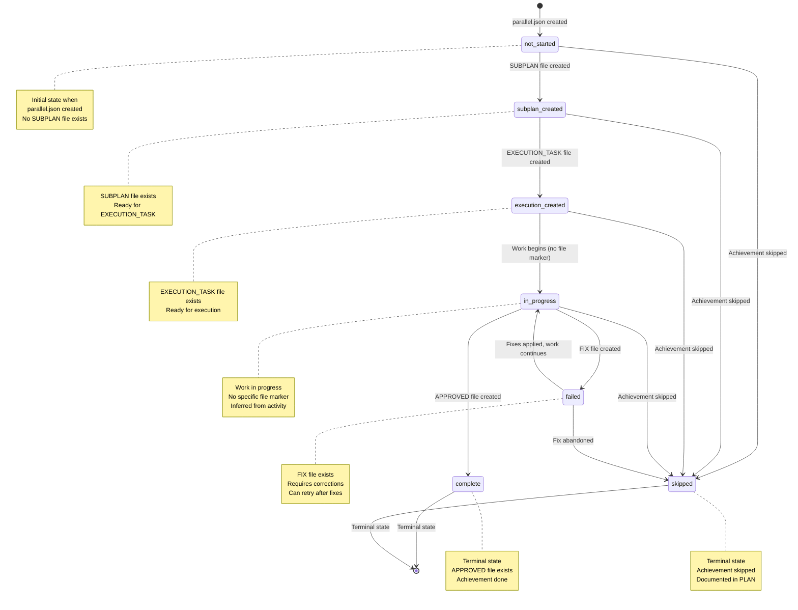

# parallel.json Status Transition Diagram

**Version**: 1.0  
**Created**: 2025-11-13  
**Related**: `parallel-schema-documentation.md`, `parallel-schema.json`

---

## 📊 State Diagram



---

## 📋 State Descriptions

### `not_started`

**Description**: Initial state when achievement is defined in `parallel.json` but no work has begun.

**Filesystem Indicator**: No SUBPLAN file exists for this achievement.

**File Check**:
```python
def is_not_started(achievement_id):
    subplan_path = f"subplans/SUBPLAN_{PLAN_NAME}_{achievement_id.replace('.', '')}.md"
    return not os.path.exists(subplan_path)
```

**Characteristics**:
- Achievement is defined in PLAN
- Listed in parallel.json
- No files created yet
- Can start if dependencies are met

**Next States**:
- `subplan_created`: When SUBPLAN file is created
- `skipped`: If achievement is skipped

---

### `subplan_created`

**Description**: SUBPLAN document has been created, defining the approach and execution strategy.

**Filesystem Indicator**: SUBPLAN file exists.

**File Check**:
```python
def is_subplan_created(achievement_id):
    subplan_path = f"subplans/SUBPLAN_{PLAN_NAME}_{achievement_id.replace('.', '')}.md"
    execution_path = f"execution/EXECUTION_TASK_{PLAN_NAME}_{achievement_id.replace('.', '')}_01.md"
    return os.path.exists(subplan_path) and not os.path.exists(execution_path)
```

**Characteristics**:
- Design phase complete
- Approach documented
- Ready for EXECUTION_TASK creation
- Executor can review SUBPLAN

**Next States**:
- `execution_created`: When EXECUTION_TASK file is created
- `skipped`: If achievement is skipped after review

---

### `execution_created`

**Description**: EXECUTION_TASK document has been created, providing detailed execution instructions.

**Filesystem Indicator**: EXECUTION_TASK file exists.

**File Check**:
```python
def is_execution_created(achievement_id):
    execution_path = f"execution/EXECUTION_TASK_{PLAN_NAME}_{achievement_id.replace('.', '')}_01.md"
    approved_path = f"execution/feedbacks/APPROVED_{achievement_id.replace('.', '')}.md"
    fix_path = f"execution/feedbacks/FIX_{achievement_id.replace('.', '')}.md"
    return (os.path.exists(execution_path) and 
            not os.path.exists(approved_path) and 
            not os.path.exists(fix_path))
```

**Characteristics**:
- Execution instructions ready
- Executor can begin work
- Waiting for execution to start
- May have multiple EXECUTION_TASK files (_01, _02, etc.)

**Next States**:
- `in_progress`: When work begins (inferred)
- `skipped`: If execution is skipped

---

### `in_progress`

**Description**: Work is actively being executed.

**Filesystem Indicator**: **No specific file marker** - inferred from:
- EXECUTION_TASK file exists
- No APPROVED or FIX file yet
- Recent file modifications in relevant directories
- Executor activity

**File Check**:
```python
def is_in_progress(achievement_id):
    execution_path = f"execution/EXECUTION_TASK_{PLAN_NAME}_{achievement_id.replace('.', '')}_01.md"
    approved_path = f"execution/feedbacks/APPROVED_{achievement_id.replace('.', '')}.md"
    fix_path = f"execution/feedbacks/FIX_{achievement_id.replace('.', '')}.md"
    
    # Check if EXECUTION_TASK exists and has recent modifications
    if os.path.exists(execution_path):
        if not os.path.exists(approved_path) and not os.path.exists(fix_path):
            # Check if EXECUTION_TASK was modified recently (e.g., last 24 hours)
            mtime = os.path.getmtime(execution_path)
            if time.time() - mtime < 86400:  # 24 hours
                return True
    return False
```

**Characteristics**:
- Executor is working
- Code/documentation being created
- Iteration log being updated
- No final status yet

**Next States**:
- `complete`: When APPROVED file is created
- `failed`: When FIX file is created
- `skipped`: If work is abandoned

---

### `complete`

**Description**: Achievement has been completed and approved.

**Filesystem Indicator**: APPROVED file exists.

**File Check**:
```python
def is_complete(achievement_id):
    approved_path = f"execution/feedbacks/APPROVED_{achievement_id.replace('.', '')}.md"
    return os.path.exists(approved_path)
```

**Characteristics**:
- **Terminal state** - no further transitions
- All deliverables created
- Review completed
- APPROVED file documents success
- Achievement can unblock dependent achievements

**Next States**: None (terminal)

---

### `failed`

**Description**: Execution completed but requires fixes before approval.

**Filesystem Indicator**: FIX file exists.

**File Check**:
```python
def is_failed(achievement_id):
    fix_path = f"execution/feedbacks/FIX_{achievement_id.replace('.', '')}.md"
    approved_path = f"execution/feedbacks/APPROVED_{achievement_id.replace('.', '')}.md"
    return os.path.exists(fix_path) and not os.path.exists(approved_path)
```

**Characteristics**:
- Execution completed but issues found
- FIX file documents required corrections
- Executor must address issues
- Can retry after fixes applied
- Not a terminal state

**Next States**:
- `in_progress`: When fixes are applied and work continues
- `skipped`: If fixes are abandoned

---

### `skipped`

**Description**: Achievement was skipped and will not be completed.

**Filesystem Indicator**: Documented in PLAN or explicit skip marker.

**File Check**:
```python
def is_skipped(achievement_id):
    # Check for explicit skip marker or PLAN documentation
    skip_path = f"execution/SKIPPED_{achievement_id.replace('.', '')}.md"
    return os.path.exists(skip_path)
```

**Characteristics**:
- **Terminal state** - no further transitions
- Achievement not needed
- Documented reason for skipping
- Does not unblock dependent achievements (they may also need to be skipped)

**Next States**: None (terminal)

---

## 🔄 Transition Table

| From State | To State | Trigger | Filesystem Event | Automated? |
|------------|----------|---------|------------------|------------|
| `not_started` | `subplan_created` | SUBPLAN created | `SUBPLAN_*.md` created | No |
| `not_started` | `skipped` | Achievement skipped | `SKIPPED_*.md` created | No |
| `subplan_created` | `execution_created` | EXECUTION_TASK created | `EXECUTION_TASK_*_01.md` created | No |
| `subplan_created` | `skipped` | Achievement skipped | `SKIPPED_*.md` created | No |
| `execution_created` | `in_progress` | Work begins | EXECUTION_TASK modified | Inferred |
| `execution_created` | `skipped` | Execution skipped | `SKIPPED_*.md` created | No |
| `in_progress` | `complete` | Review approved | `APPROVED_*.md` created | No |
| `in_progress` | `failed` | Review requires fixes | `FIX_*.md` created | No |
| `in_progress` | `skipped` | Work abandoned | `SKIPPED_*.md` created | No |
| `failed` | `in_progress` | Fixes applied | EXECUTION_TASK modified | Inferred |
| `failed` | `skipped` | Fixes abandoned | `SKIPPED_*.md` created | No |
| `complete` | - | Terminal state | - | - |
| `skipped` | - | Terminal state | - | - |

---

## 🎯 Filesystem-First Philosophy

### Core Principle

**Status is DERIVED from filesystem, not PERSISTED in parallel.json.**

### Why This Matters

1. **Single Source of Truth**: Filesystem is authoritative
2. **No Synchronization**: No need to update parallel.json when status changes
3. **Multi-Executor Safe**: Multiple executors can work without conflicts
4. **Always Accurate**: Status computed on-demand from filesystem
5. **No Stale Data**: Can't have outdated status in parallel.json

### Implementation Pattern

```python
def get_achievement_status(achievement_id):
    """
    Compute achievement status from filesystem.
    This is called every time status is needed - never cached in parallel.json.
    """
    # Check for terminal states first
    if is_complete(achievement_id):
        return "complete"
    
    if is_skipped(achievement_id):
        return "skipped"
    
    # Check for failed state
    if is_failed(achievement_id):
        return "failed"
    
    # Check for in-progress (inferred)
    if is_in_progress(achievement_id):
        return "in_progress"
    
    # Check for execution_created
    if is_execution_created(achievement_id):
        return "execution_created"
    
    # Check for subplan_created
    if is_subplan_created(achievement_id):
        return "subplan_created"
    
    # Default: not_started
    return "not_started"
```

### Status in parallel.json

The `status` field in `parallel.json` is:
- **Snapshot**: Status at time of parallel.json creation
- **Placeholder**: Initial value (usually `"not_started"`)
- **Not Updated**: Never updated as work progresses
- **Ignored**: Workflow scripts recompute status from filesystem

**Example**:
```json
{
  "achievement_id": "1.1",
  "status": "not_started",  // This is a snapshot/placeholder
  "dependencies": []
}
```

When workflow script reads this:
```python
# DON'T use status from parallel.json
status = parallel_json['achievements']['1.1']['status']  # ❌ Wrong

# DO compute status from filesystem
status = get_achievement_status('1.1')  # ✅ Correct
```

---

## 🔍 Dependency Checking

### How Dependencies Work with Status

```python
def can_start_achievement(achievement_id, parallel_json):
    """
    Check if achievement can start based on dependency status.
    """
    # Get dependencies from parallel.json
    achievement = find_achievement(achievement_id, parallel_json)
    dependencies = achievement['dependencies']
    
    # Check each dependency's status (from filesystem)
    for dep_id in dependencies:
        dep_status = get_achievement_status(dep_id)
        if dep_status != 'complete':
            print(f"Waiting for {dep_id} (status: {dep_status})")
            return False
    
    # All dependencies complete
    return True
```

### Parallel Execution Check

```python
def find_parallel_achievements(current_achievement, parallel_json):
    """
    Find achievements that can run in parallel with current achievement.
    """
    parallel_achievements = []
    
    for achievement in parallel_json['achievements']:
        ach_id = achievement['achievement_id']
        
        # Skip current achievement
        if ach_id == current_achievement:
            continue
        
        # Check if achievement can start
        if can_start_achievement(ach_id, parallel_json):
            # Check if it's not already complete or in progress
            status = get_achievement_status(ach_id)
            if status in ['not_started', 'subplan_created', 'execution_created']:
                parallel_achievements.append(ach_id)
    
    return parallel_achievements
```

---

## 📈 Status Tracking Example

### Scenario: Level 2 Parallelization

**Initial State** (parallel.json created):
```json
{
  "achievements": [
    {"achievement_id": "3.1", "status": "not_started", "dependencies": ["2.2"]},
    {"achievement_id": "3.2", "status": "not_started", "dependencies": ["2.2"]},
    {"achievement_id": "3.3", "status": "not_started", "dependencies": ["2.2"]}
  ]
}
```

**Filesystem Status** (computed):
- 3.1: `not_started` (no SUBPLAN file)
- 3.2: `not_started` (no SUBPLAN file)
- 3.3: `not_started` (no SUBPLAN file)
- 2.2: `complete` (APPROVED_22.md exists)

**After SUBPLANs Created**:
- Filesystem: `SUBPLAN_*_31.md`, `SUBPLAN_*_32.md`, `SUBPLAN_*_33.md` created
- Computed Status: 3.1, 3.2, 3.3 → `subplan_created`
- parallel.json: **Unchanged** (still shows `not_started`)

**After EXECUTION_TASKs Created**:
- Filesystem: `EXECUTION_TASK_*_31_01.md`, etc. created
- Computed Status: 3.1, 3.2, 3.3 → `execution_created`
- parallel.json: **Unchanged**

**During Execution**:
- Filesystem: EXECUTION_TASK files modified
- Computed Status: 3.1, 3.2, 3.3 → `in_progress`
- parallel.json: **Unchanged**

**After Completion**:
- Filesystem: `APPROVED_31.md`, `APPROVED_32.md`, `APPROVED_33.md` created
- Computed Status: 3.1, 3.2, 3.3 → `complete`
- parallel.json: **Unchanged**

**Key Insight**: parallel.json never changes, but computed status accurately reflects progress.

---

## 🚀 Integration with Workflow

### Workflow Script Pseudocode

```python
def execute_parallel_workflow(plan_name):
    # Load parallel.json
    parallel_json = load_parallel_json(plan_name)
    
    while not all_achievements_complete(parallel_json):
        # Find achievements that can start
        ready_achievements = []
        
        for achievement in parallel_json['achievements']:
            ach_id = achievement['achievement_id']
            
            # Compute status from filesystem
            status = get_achievement_status(ach_id)
            
            # Skip if already complete or in progress
            if status in ['complete', 'in_progress', 'skipped']:
                continue
            
            # Check if dependencies are met
            if can_start_achievement(ach_id, parallel_json):
                ready_achievements.append(ach_id)
        
        if ready_achievements:
            print(f"Ready to start: {ready_achievements}")
            print("These can run in parallel!")
            
            # User/system decides which to start
            # Multiple executors can work on different achievements
        else:
            print("Waiting for dependencies to complete...")
            time.sleep(60)  # Check again in 1 minute
```

---

## 📚 Related Documentation

- **Schema Documentation**: `documentation/parallel-schema-documentation.md`
- **Schema File**: `parallel-schema.json`
- **Examples**:
  - `examples/parallel_level1_example.json`
  - `examples/parallel_level2_example.json`
  - `examples/parallel_level3_example.json`
- **Prompt Builder**: `LLM/scripts/generation/parallel_prompt_builder.py`

---

**Last Updated**: 2025-11-13  
**Version**: 1.0  
**Maintainer**: PARALLEL-EXECUTION-AUTOMATION team

